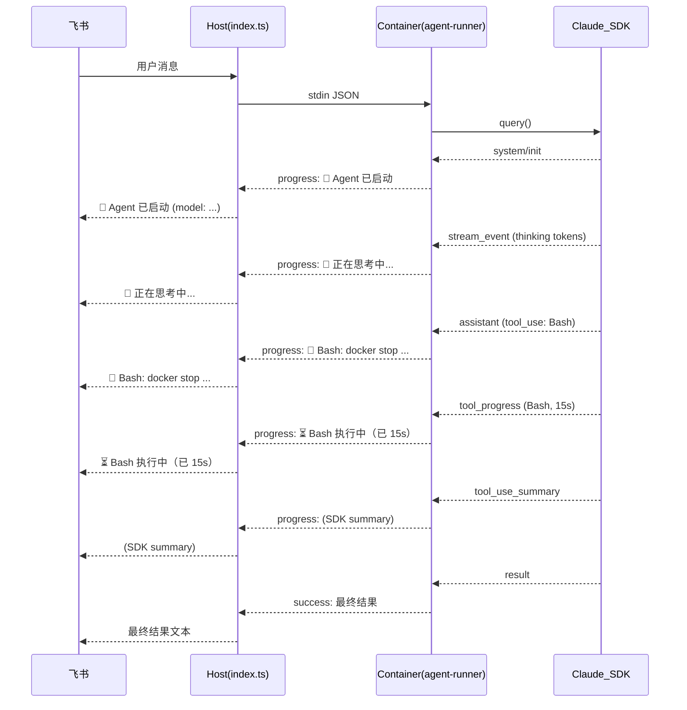

# 流式进度通知：回传 Claude Code 全量执行过程

## 核心思路

Claude Agent SDK 的 `query()` 返回 22 种消息类型的 async iterable。目前只有 `result` 类型被转发给用户，其余全部丢弃。方案是：对所有有价值的消息类型格式化后，通过现有 stdout marker 协议发回 host，再转发到飞书。

## 需要转发的消息类型（18 种）

按优先级和频率分层：

### 高价值（核心执行过程）


| SDK 类型                   | type 字段            | 格式化示例                                                             |
| ------------------------ | ------------------ | ----------------------------------------------------------------- |
| SDKAssistantMessage      | `assistant`        | 提取 tool_use 块：`🔧 Bash: docker stop ...` / `📂 Read: config.json` |
| SDKToolUseSummaryMessage | `tool_use_summary` | 直接用 SDK 的 summary 字段（已是一行摘要）                                      |
| SDKToolProgressMessage   | `tool_progress`    | `⏳ Bash 执行中（已 15s）`                                               |
| SDKResultMessage         | `result`           | **已有**，不改。success 时发最终文本，error 时发错误信息                             |


### 中价值（子任务 & 系统事件）


| SDK 类型                     | type 字段                    | 格式化示例                                            |
| -------------------------- | -------------------------- | ------------------------------------------------ |
| SDKTaskStartedMessage      | `system/task_started`      | `🚀 子任务启动: 搜索相关文件...`                            |
| SDKTaskProgressMessage     | `system/task_progress`     | `📊 子任务进度: 已调用 12 个工具，用时 30s`                    |
| SDKTaskNotificationMessage | `system/task_notification` | `✅ 子任务完成: 找到 3 个匹配文件` / `❌ 子任务失败: ...`           |
| SDKSystemMessage           | `system/init`              | `🤖 Agent 已启动 (model: claude-sonnet-4-20250514)` |
| SDKCompactBoundaryMessage  | `system/compact_boundary`  | `📦 上下文压缩 (tokens: 180000 → compact)`            |
| SDKRateLimitEvent          | `rate_limit_event`         | `⚠️ 限流中，预计 {resetsAt} 恢复`                        |


### 低价值（Hook & 认证等）


| SDK 类型                        | type 字段                       | 格式化示例                                                    |
| ----------------------------- | ----------------------------- | -------------------------------------------------------- |
| SDKHookStartedMessage         | `system/hook_started`         | `🪝 Hook: {hook_name}`                                   |
| SDKHookProgressMessage        | `system/hook_progress`        | `🪝 Hook 进度: {hook_name}`                                |
| SDKHookResponseMessage        | `system/hook_response`        | `🪝 Hook 完成: {hook_name} ({outcome})`                    |
| SDKAuthStatusMessage          | `auth_status`                 | `🔑 认证中...` / `🔑 认证失败: {error}`                         |
| SDKFilesPersistedEvent        | `system/files_persisted`      | `💾 已保存 {n} 个文件`                                         |
| SDKElicitationCompleteMessage | `system/elicitation_complete` | `📝 MCP 交互完成: {server_name}`                             |
| SDKStatusMessage              | `system/status`               | `📡 状态: {status}`                                        |
| SDKPartialAssistantMessage    | `stream_event`                | **不逐 token 转发**，仅用于检测"思考中"状态，合并为 `💭 正在思考中...`（去重，仅首次发送） |


### 不转发（4 种）

- SDKUserMessage / SDKUserMessageReplay — 用户自己发的消息
- SDKLocalCommandOutputMessage — 本地命令，容器中不适用
- SDKPromptSuggestionMessage — prompt 建议，不需要

## 数据流




## 涉及文件

### 1. [container/agent-runner/src/index.ts](container/agent-runner/src/index.ts) — 提取并发送进度

扩展 `ContainerOutput` 类型：

```typescript
interface ContainerOutput {
  status: 'success' | 'error' | 'progress';
  result: string | null;
  newSessionId?: string;
  error?: string;
}
```

新增 `formatProgress(message: SDKMessage): string | null` 函数，集中处理所有消息类型的格式化。返回 null 表示不转发。

在 `runQuery` 的 `for await` 循环中，在现有 log 之后添加：

```typescript
const progress = formatProgress(message);
if (progress) {
  writeOutput({ status: 'progress', result: progress });
}
```

**关键格式化逻辑**：

- `assistant` 类型：遍历 `message.message.content`，提取 `tool_use` 块，格式化工具名 + 输入摘要
- `tool_use_summary`：直接使用 `message.summary`
- `tool_progress`：`⏳ {tool_name} 执行中（已 {elapsed}s）`
- `system/init`：`🤖 Agent 已启动 (model: {model})`
- `system/task_started`：`🚀 子任务: {description}`
- `system/task_progress`：`📊 子任务进度: {tool_uses} 个工具, {duration_ms/1000}s`
- `system/task_notification`：根据 status 选 ✅/❌ + summary
- `system/compact_boundary`：`📦 上下文压缩 ({pre_tokens} tokens)`
- `rate_limit_event`：`⚠️ 限流: {status}`（仅 rejected/warning 时发）
- `system/hook_`*：`🪝 Hook {hook_name}: {event}`
- `auth_status`：仅 error 或 isAuthenticating=true 时发
- `system/files_persisted`：`💾 已保存 {files.length} 个文件`
- `system/elicitation_complete`：`📝 MCP 交互完成`
- `system/status`：`📡 {status}`
- `stream_event`：用一个 `thinkingNotified` 布尔标记，首次收到时发 `💭 正在思考中...`，后续不再发。每次 assistant/result 消息后重置此标记。

### 2. [data/sessions/feishu_main/agent-runner-src/index.ts](data/sessions/feishu_main/agent-runner-src/index.ts) — 同步到 live 副本

与模板完全相同的改动。

### 3. [src/index.ts](src/index.ts) — 处理 progress 输出 + 心跳定时器

**A. onOutput 回调**（约第 252 行）新增 progress 处理：

```typescript
async (result) => {
  if (result.status === 'progress' && result.result) {
    await channel.sendMessage(chatJid, result.result);
    resetHeartbeat(); // 收到 progress 也重置心跳计时
    return;
  }
  // ... 现有 success/error 逻辑不变（success 时也 resetHeartbeat）
}
```

progress 消息：不重置 idle timer、不设 `outputSentToUser`、不调用 `queue.notifyIdle`。但要重置心跳计时器（因为已有进度通知了，不需要再发心跳）。

**B. 心跳定时器**（在 `processGroupMessages` 内，idleTimer 附近）：

作为流式进度的兜底。当容器在运行但长时间没有任何输出（progress 或 result）时，定期告诉用户任务还活着：

```typescript
let heartbeatTimer: ReturnType<typeof setInterval> | null = null;
const heartbeatStart = Date.now();

const startHeartbeat = () => {
  if (!HEARTBEAT_INTERVAL_MS) return;
  heartbeatTimer = setInterval(async () => {
    const mins = Math.round((Date.now() - heartbeatStart) / 60_000);
    await channel.sendMessage(chatJid, `⏳ 任务仍在处理中（已用时约 ${mins} 分钟）`);
  }, HEARTBEAT_INTERVAL_MS);
};

const resetHeartbeat = () => {
  stopHeartbeat();
  startHeartbeat();
};

const stopHeartbeat = () => {
  if (heartbeatTimer) { clearInterval(heartbeatTimer); heartbeatTimer = null; }
};
```

- `runAgent` 调用前：`startHeartbeat()`
- 每次 `onOutput`（无论 progress 还是 success）：`resetHeartbeat()`
- `runAgent` 完成后（finally 块）：`stopHeartbeat()`

心跳和流式进度互补：如果 agent 在思考且没有 stream_event 或工具调用，心跳兜底；如果进度消息正常流转，心跳不断被重置所以不会触发。

### 4. [src/config.ts](src/config.ts) — 开关和心跳配置

```typescript
export const STREAM_PROGRESS =
  (process.env.STREAM_PROGRESS || 'true') !== 'false';

export const HEARTBEAT_INTERVAL_MS = parseInt(
  process.env.HEARTBEAT_INTERVAL_MS || '120000', // 默认 2 分钟
  10,
);
```

`STREAM_PROGRESS` 通过 `ContainerInput` 传入容器，agent-runner 据此决定是否发 progress。
`HEARTBEAT_INTERVAL_MS` 仅在 host 层使用，设为 `0` 可禁用。

### 5. [src/container-runner.ts](src/container-runner.ts) — progress 不重置 hard timeout

```typescript
if (parsed.status !== 'progress') {
  resetTimeout();
}
```

## 防刷屏策略

1. **节流**：agent-runner 中维护 `lastProgressTime`，同类型消息间隔 < 3 秒时跳过
2. **stream_event 去重**：`💭 正在思考中...` 只发一次，直到下一个非 stream_event 消息后重置
3. **tool_progress 去重**：同一个 `tool_use_id` 只在 elapsed > 10s 后才开始发，之后每 10s 发一次

