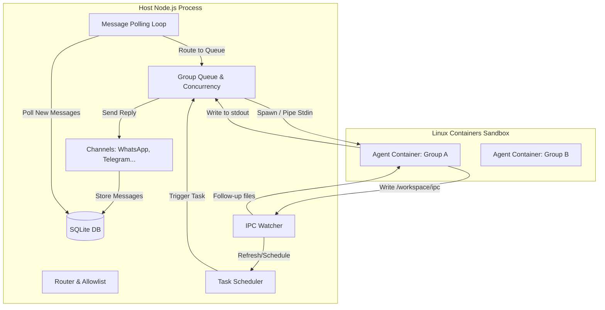

# NanoClaw 架构系统分析

## 1. 项目定位与设计哲学

**项目定位**：NanoClaw 是一个轻量级、高度定制化且极具安全性的个人 AI 助手系统，旨在替代臃肿庞大、缺乏操作系统级隔离的传统机器人框架（如 OpenClaw）。
**设计哲学**：
- **足够小，易于理解**：单 Node.js 进程核心，无微服务，无过度抽象。
- **真正的容器级安全隔离**：Agent 运行在独立的 Linux 容器（Docker/Apple Container）中，拥有独立文件系统，限制了潜在的代码注入或 Bash 执行越权。
- **Skill 优于 Feature**：拒绝特性膨胀（Feature bloat），不使用复杂的配置文件，而是通过提供 Claude Code Skills（如 `/add-telegram`）让 LLM 直接修改你的本地代码以满足定制需求。

## 2. 整体架构图



## 3. 核心模块逐一说明

- **`src/index.ts` (Orchestrator)**：系统的入口点。负责加载配置、初始化 SQLite 数据库、启动所有已注册的 Channel（通过工厂模式）、启动 IPC 监听、Task Scheduler，以及核心的 `startMessageLoop` 消息轮询循环。
- **`src/channels/registry.ts`**：管理 Channel 扩展。提供 `registerChannel` 接口。各个 Channel（如 WhatsApp、Slack）在启动时自我注册，核心引擎遍历并连接拥有凭证的 Channel。
- **`src/group-queue.ts` (GroupQueue)**：组级别并发与队列控制器。限制全局最大容器数量，避免资源耗尽。同时防止针对同一个群组启动多个容器造成状态冲突。向正在运行的容器注入后续对话（通过 IPC文件）。
- **`src/container-runner.ts`**：容器调度与隔离引擎。根据请求所属的 Group 拼接目录挂载规则（读写与只读分离）、环境变量（屏蔽密钥），并通过 `spawn` 启动 `docker` 或 `Apple Container`。它还负责解析容器 `stdout` 传回的 JSON 格式数据对。
- **`src/ipc.ts` (IPC Watcher)**：跨容器或容器与宿主机的通信总线。轮询基于文件系统的 `/workspace/ipc/` 目录，允许容器触发定时任务(`schedule_task`)、暂停任务、或者向宿主机和其他群组发送消息。
- **`container/agent-runner/src/index.ts` (Agent Wrapper)**：容器内部运行的核心 JS 脚本。**这是实际封装和调用 Claude Agent SDK 的地方**，通过长连接和文件轮询的方式与宿主进行双向通信。

## 4. 消息全链路流程

以下是用户发送消息到得到回复的完整追踪：

```mermaid
sequenceDiagram
    participant User as User (WhatsApp)
    participant Channel as Channel (src/channels)
    participant DB as SQLite DB
    participant Loop as startMessageLoop (index.ts)
    participant Queue as GroupQueue
    participant Runner as container-runner.ts
    participant Agent as container/agent-runner

    User->>Channel: Send message
    Channel->>DB: storeMessage(msg)
    Loop->>DB: getNewMessages()
    DB-->>Loop: Return unread msgs
    Loop->>Queue: enqueueMessageCheck(groupJid)
    Queue->>Runner: runContainerAgent(prompt)
    Runner->>Agent: Spawn container & pipe input JSON to stdin
    activate Agent
    Agent->>Agent: Call Claude Agent SDK query()
    Agent->>Agent: Agent reasoning & tool use
    Agent-->>Runner: stdout: <START> JSON <END>
    Runner->>Queue: Parse stream output
    Queue->>Channel: sendMessage(chatJid, text)
    Channel->>User: Reply delivered
    deactivate Agent
```

## 5. 容器隔离机制

Agent 并非以原生 Node.js 的上下文直接运行，而是被硬隔离：

- **运行机制**：每次分配任务时，`src/container-runner.ts` 会动态构建 `docker run`（或 Apple Container） 命令，执行 `nanoclaw-agent` 镜像。
- **目录挂载 (Mounts)**：
  - `/workspace/project`：宿主机根目录，**只读挂载**（防止 Agent 修改宿主机主代码实现逃逸）。
  - `/workspace/group`：各个 Group 独立的文件夹，**读写挂载**，存储对话状态和私有文件。
  - `/home/node/.claude`：Agent 状态目录（包括 Skills 配置），与 Group 绑定隔离。
  - `/workspace/ipc`：专供该 Group 使用的 IPC 文件夹。
  - **屏蔽密钥**：宿主机的 `.env` 被挂载为 `/dev/null` 彻底隐藏。密钥（API Keys）仅通过标准输入 (`stdin`) 传递给容器内存，绝部落盘。
- **IPC 通信 (Inter-Process Communication)**：
  因为安全隔离，容器不能直接发网络请求给主进程。容器内的 `agent-runner` 会将需要发送的系统指令或消息写成 JSON 文件到 `/workspace/ipc/messages` 或 `tasks`。宿主机的 `src/ipc.ts` 设置定时轮询，发现文件后进行合法性校验并执行，然后删除该文件。

## 6. 扩展机制

NanoClaw 的设计理念是不产生代码膨胀，**"Don't add features. Add skills."**

- **如何添加一个新 Channel (如 Telegram)**：
  不需要在主库提 PR。你只需要创建一个 Skill（存放于 `.claude/skills/add-telegram/SKILL.md`）。在 Skill 文件中，你指示 Claude LLM："请在 `src/channels/telegram.ts` 中实现 `Channel` 接口，然后在 `src/channels/index.ts` 中引入它进行注册，并安装相关的 npm 依赖"。使用者运行 `/add-telegram` 就会获得属于他个人的修改版代码。
- **如何添加一个新 Skill**：
  直接在宿主机的 `.claude/skills/` 目录下创建一个包含指令说明的 `SKILL.md`。由于在 `container-runner.ts` 的逻辑里，宿主机的 `container/skills` 和 `.claude/skills` 会被自动同步挂载到容器的 `/home/node/.claude/skills` 目录中，Claude Agent 启动后会自动识别并可以使用这些 Skills。

## 7. 推荐阅读路径（学习者视角）

1. **`docs/REQUIREMENTS.md` & `README.md`**：首先理解为什么要用单线程 + 容器的极致隔离设计。
2. **`src/config.ts` & `src/types.ts`**：了解系统全局变量和核心数据结构。
3. **`src/index.ts`**：核心的心跳所在。重点看 `startMessageLoop` 函数。
4. **`src/group-queue.ts`**：学习作者是如何在没有 Redis 的情况下实现优雅的容器并发排队与输入注入的。
5. **`src/container-runner.ts`**：重中之重，看看安全挂载 (`buildVolumeMounts`) 和如何解析复杂的 stdout stream。
6. **`container/agent-runner/src/index.ts`**：容器内的入口，这是系统与 Claude Code 的接壤点。
7. **`src/ipc.ts`**：学习跨容器的文件级安全通讯方案。

## 8. 详细解答：如何封装 Claude Code？

你最关心的 **"是怎么把 claude code 封装起来的，包括 skills 如何给 claude code"**，这主要实现在 `container/agent-runner/src/index.ts` 及其容器挂载策略中：

### A. 驱动 Claude Agent SDK
NanoClaw 并不使用公开的 Anthropic HTTP API 组装上下文，而是直接导入并使用了官方 CLI 背后的核心库 `@anthropic-ai/claude-agent-sdk`：
```typescript
import { query, HookCallback, PreCompactHookInput, PreToolUseHookInput } from '@anthropic-ai/claude-agent-sdk';
```
在 `runQuery` 函数中，通过调用 SDK 暴露的 `query()` 方法，赋予 LLM 使用 Bash、文件读写、Task 调度、以及多智能体协同 (`TeamCreate`) 等高级能力。

### B. 突破 `isSingleUserTurn` 限制与流式会话保持
为了让 Agent Swarm (多智能体团队) 能够长时间运行，并且支持在运行中接受用户的新消息插入（例如 WhatsApp 追加的新消息），系统实现了一个巧妙的异步生成器 `MessageStream`：
```typescript
class MessageStream { ... async *[Symbol.asyncIterator]() ... }
```
容器外的主进程收到新消息时，会将其写入 `/workspace/ipc/input/`。容器内的代码会设置定时器 `pollIpcDuringQuery` 不断轮询这个目录。一旦有新文件，它会通过 `stream.push(text)` 将用户的最新语句实时塞入正在执行的 `query` 流中。这保证了底层 SDK 的会话不会中断。

### C. Tools (工具) 与 MCP 服务器的封装
在传递给 `query` 的配置中：
- 明确放开了 `allowedTools: ['Bash', 'Read', 'Write', 'Task', 'TeamCreate', ...]` 权限。
- 本地 MCP 集成：挂载了内部的 `ipc-mcp-stdio.js` 作为 MCP Server，提供比如 `mcp__nanoclaw__schedule_task` 等调度工具。这实际上也是走的 `ipc` 机制回传到宿主机。

### D. Hooks 劫持与安全擦除
在传入的 options 里，定义了 `PreToolUse` Hook：
```typescript
PreToolUse: [{ matcher: 'Bash', hooks: [createSanitizeBashHook()] }]
```
`createSanitizeBashHook()` 会在 LLM 尝试执行任何 Bash 命令**之前**，强制在命令开头加上 `unset ANTHROPIC_API_KEY CLAUDE_CODE_OAUTH_TOKEN 2>/dev/null; `。这个细节极其关键：它使得即便 Agent 被恶意 prompt 注入想要盗取环境变量里的 Token，派生出的 Bash 子进程也读取不到真正的秘钥，实现了完美的隔离墙。

### E. Skills 的透传加载
Skills 是如何让容器内部的 Claude SDK 读到的？
1. 在宿主机中，所有由用户添加的系统级 capabilities 会放在 `.claude/skills/` 或者是 `container/skills/` 目录下。
2. 每次组装容器参数时（见 `src/container-runner.ts` 的 `buildVolumeMounts`）：
   ```typescript
   // 宿主的 skills 目录
   const skillsSrc = path.join(process.cwd(), 'container', 'skills');
   // 复制到给特定 group 的 session 目录中
   const skillsDst = path.join(groupSessionsDir, 'skills');
   fs.cpSync(skillsSrc, dstDir, { recursive: true });
   
   // 然后将此目录挂载到容器的默认 ~/.claude
   mounts.push({
     hostPath: groupSessionsDir,
     containerPath: '/home/node/.claude',
     readonly: false,
   });
   ```
3. 因为挂载到了容器的 `/home/node/.claude`，当 `agent-runner` 里调用 `query()` 时，底层的 Claude SDK 启动时读取该目录，自动识别并加载所有 Skills，使 Agent 具备项目自有的专业知识和定制命令。