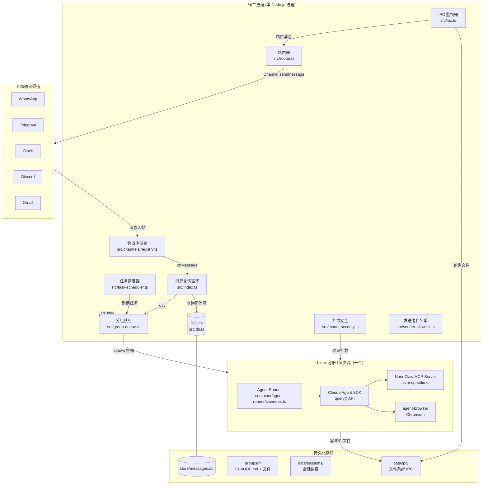
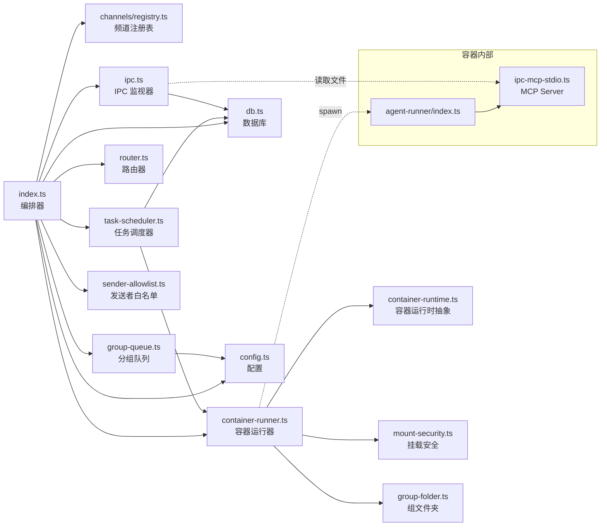
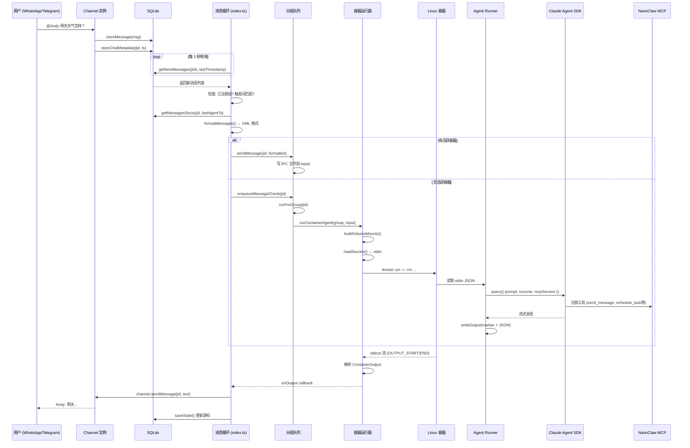
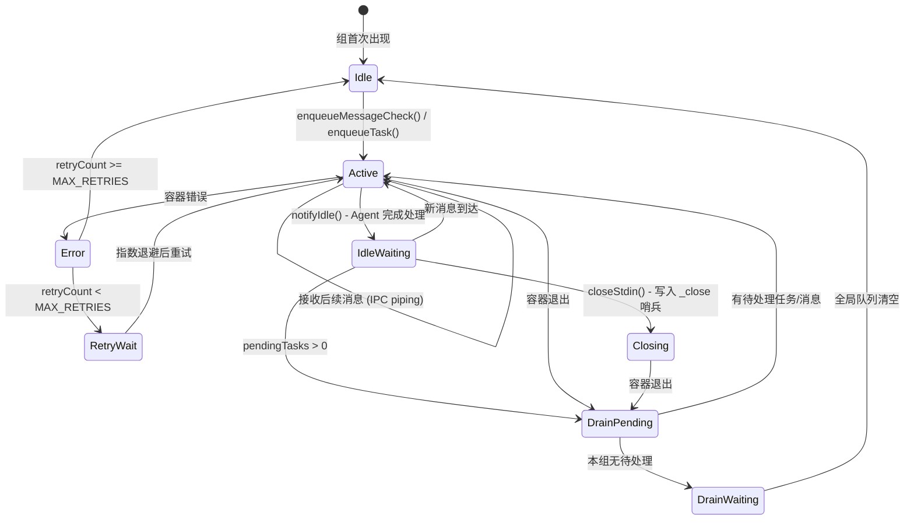
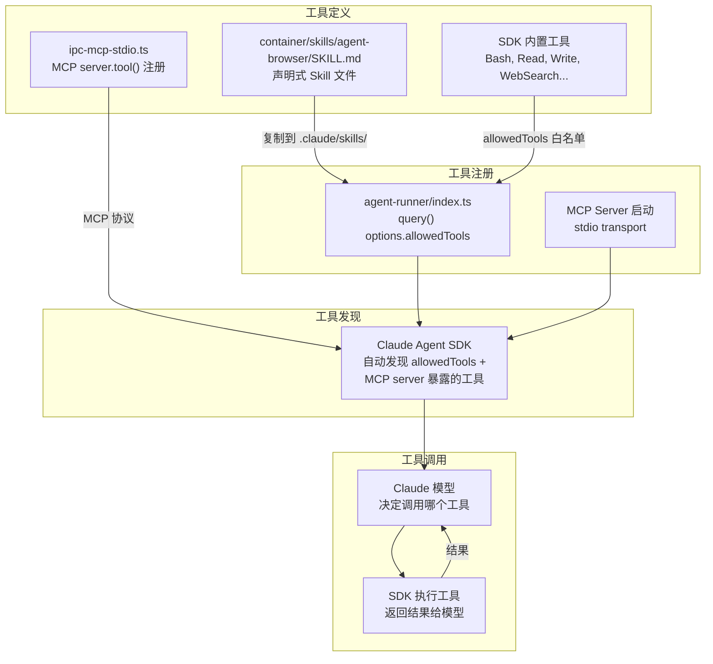
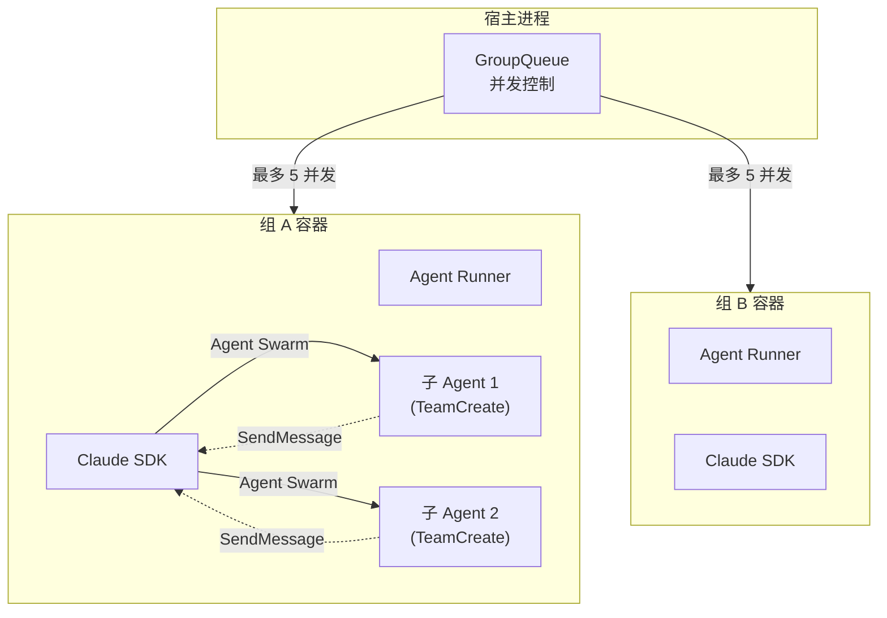
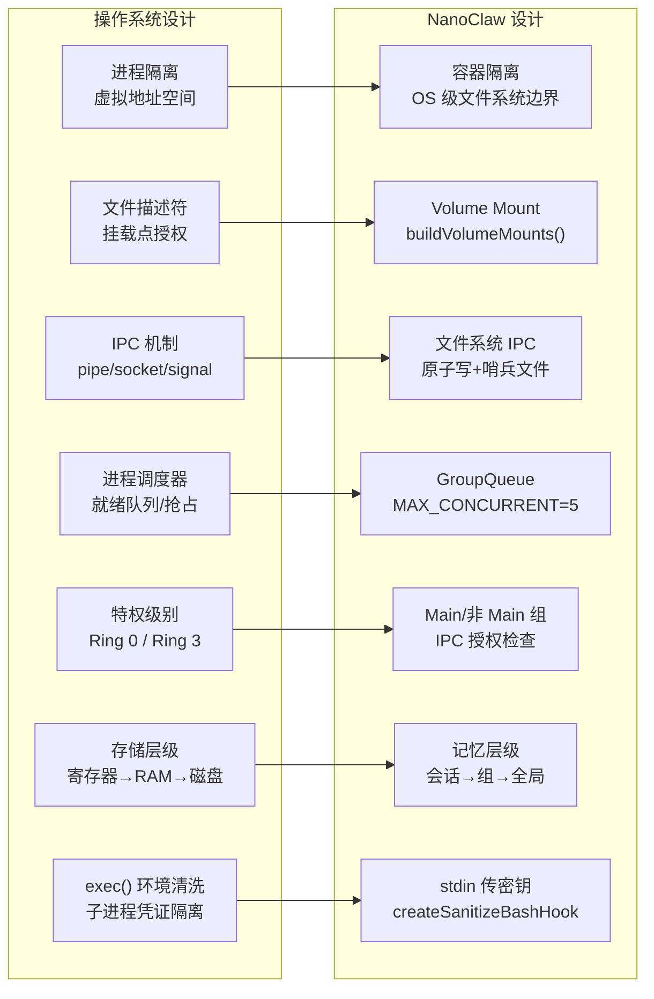

# NanoClaw 架构与逻辑白皮书

> 本文档对 NanoClaw 项目进行全面的"降维解构"分析，旨在帮助高级 Agent 开发工程师快速掌握其底层工程逻辑。

---

## Part 1: 设计哲学与第一性原理

### 核心问题

NanoClaw 解决的**本质问题**是：如何让个人用户安全地通过即时通讯渠道（WhatsApp、Telegram、Slack 等）与一个具备完整工具能力的 AI Agent 交互，同时确保 Agent 的执行环境是真正隔离的。

### 第一性原理

**"安全不靠权限检查，靠物理隔离。"** NanoClaw 的核心"赌注"是：与其在应用层面构建复杂的权限系统来限制 Agent 行为，不如直接将 Agent 放进 Linux 容器（Docker/Apple Container），通过 OS 级别的文件系统隔离来限定 Agent 能看到什么、能做什么。这一决策使得整个安全模型简洁到可以用一句话概括：**Agent 只能访问被显式挂载的目录**。

### 生态定位与差异化

| 维度 | NanoClaw | OpenClaw (前身 ClawBot) | 通用 Agent 框架 (LangChain等) |
|------|----------|------------------------|-------------------------------|
| 代码规模 | ~35K tokens，十几个核心文件 | ~50万行代码，70+依赖 | 数十万行，大量抽象层 |
| 安全模型 | OS 级容器隔离 | 应用层权限检查 | 依赖调用方自行实现 |
| 扩展方式 | Skill（代码变换） | 配置+插件 | 插件/Chain |
| 目标用户 | 个人用户，一人一实例 | 通用多用户 | 开发者/企业 |
| 运维复杂度 | 单进程，launchd/systemd | 多进程多网关 | 依赖部署方式 |
| AI 原生程度 | Claude Code 引导安装/调试/定制 | 传统 CLI/Web UI | API 调用 |

### 项目成熟度评估

| 维度 | 评分 | 证据 |
|------|------|------|
| 代码结构 | ⭐⭐⭐⭐ | 清晰的模块分离，每个文件职责单一（`src/index.ts` 编排、`src/db.ts` 数据、`src/container-runner.ts` 容器） |
| 文档完整性 | ⭐⭐⭐⭐⭐ | README、SPEC、REQUIREMENTS、SECURITY、CLAUDE.md 形成完整文档体系 |
| 测试覆盖 | ⭐⭐⭐ | 有 vitest 测试框架，核心模块有测试文件（`db.test.ts`、`registry.test.ts`、`container-runner.test.ts` 等），但非完全覆盖 |
| 安全设计 | ⭐⭐⭐⭐ | 多层安全机制（容器隔离、挂载白名单、IPC 授权、凭证过滤），有专门的 `docs/SECURITY.md` |
| 可扩展性 | ⭐⭐⭐⭐⭐ | 频道注册表 + Skills Engine 的设计使得扩展极为优雅 |

---

## Part 2: 静态架构图

### 高层架构概览



### 3-5 个最关键模块

#### 模块 1：编排器 (`src/index.ts`)

**角色**：系统的"大脑"——管理全局状态、驱动消息循环、协调所有子系统的启动。

**关键机制**：
- `main()` 函数编排启动序列：容器运行时检查 → 数据库初始化 → 状态加载 → 频道连接 → 子系统启动
- `startMessageLoop()` 是一个无限轮询循环，每 2 秒（`POLL_INTERVAL`）从 SQLite 拉取新消息
- `processGroupMessages()` 是每个组消息处理的核心，负责触发检查、消息格式化、容器调用、错误回滚
- 维护两个关键游标：`lastTimestamp`（全局已读标记）和 `lastAgentTimestamp[chatJid]`（每组 Agent 处理标记）

**与其他模块的"握手"**：
- 通过 `GroupQueue` 控制并发和排队
- 通过 `findChannel()` 路由消息到正确的频道
- 通过 `runContainerAgent()` 启动容器执行

#### 模块 2：容器运行器 (`src/container-runner.ts`)

**角色**：安全边界的实现者——构建卷挂载、启动容器进程、解析流式输出。

**关键机制**：
- `buildVolumeMounts()` 根据组的权限（Main vs 非 Main）构建不同的挂载方案
- `readSecrets()` 从 `.env` 读取凭证，通过 stdin 传入容器（而非写入文件或环境变量）
- 使用哨兵标记（`OUTPUT_START_MARKER` / `OUTPUT_END_MARKER`）从 stdout 流中解析结构化输出
- 超时管理：硬超时 + 活动检测重置 + 空闲超时后的优雅关闭

#### 模块 3：分组队列 (`src/group-queue.ts`)

**角色**：并发控制器——确保同一组的消息串行处理，不同组的容器并行运行但不超过上限。

**关键机制**：
- `MAX_CONCURRENT_CONTAINERS`（默认 5）全局并发限制
- 每组维护独立状态（`GroupState`）：活跃/空闲、进程引用、待处理消息/任务队列
- `sendMessage()` 方法支持向活跃容器"注入"后续消息（通过 IPC 文件）
- `closeStdin()` 写入 `_close` 哨兵文件信号容器关闭
- 指数退避重试（最多 5 次，基础延迟 5 秒）
- `drainGroup()` → `drainWaiting()` 的级联排水机制

#### 模块 4：Agent Runner (`container/agent-runner/src/index.ts`)

**角色**：容器内的"驾驶员"——接收输入、驱动 Claude Agent SDK、管理会话生命周期。

**关键机制**：
- `MessageStream` 类：基于 AsyncIterable 的推送流，保持 SDK 查询循环活跃
- 查询循环：`runQuery()` → 等待 IPC → `runQuery()` → ... 直到 `_close`
- 通过 `PreCompact` Hook 在上下文压缩前归档对话
- 通过 `PreToolUse` Hook 从 Bash 子进程环境中移除密钥
- 会话恢复（`resume` + `resumeSessionAt`）实现对话连续性

#### 模块 5：Skills Engine (`skills-engine/`)

**角色**：代码变换引擎——管理 Skill 的应用、回滚、合并冲突解决，使 NanoClaw 能"安全变形"。

**关键机制**：
- 三路合并（`mergeFile`）：当前文件 ← 基准 → Skill 修改
- 状态追踪（`.nanoclaw/state.json`）：记录已应用的 Skill、文件哈希、自定义修改
- 漂移检测：对比当前文件哈希与基准哈希，发现手动修改
- 备份/恢复原子操作，确保失败时可完整回滚
- 锁机制防止并发应用

### 模块依赖关系图



### 扩展点 / 插件接口

| 扩展点 | 位置 | 机制 | 说明 |
|--------|------|------|------|
| **频道注册** | `src/channels/registry.ts` | 工厂注册表模式 | 调用 `registerChannel(name, factory)` 即可添加新频道 |
| **频道桶文件** | `src/channels/index.ts` | 模块副作用导入 | 每个频道在导入时自动注册 |
| **MCP 工具** | `container/agent-runner/src/ipc-mcp-stdio.ts` | MCP Server 标准 | 通过 `server.tool()` 添加新工具 |
| **容器 Skills** | `container/skills/` | CLAUDE.md Skill 文件 | 同步到容器的 `.claude/skills/` 目录 |
| **Skills Engine** | `skills-engine/apply.ts` | 三路合并 + 清单驱动 | Skill 包含 `manifest.yml` + `add/` + `modify/` 目录 |
| **额外挂载** | `containerConfig.additionalMounts` | 白名单验证 | 通过 `~/.config/nanoclaw/mount-allowlist.json` 控制 |
| **Hooks** | Agent SDK `hooks` 参数 | `PreCompact` / `PreToolUse` | 容器内对 Agent 行为进行拦截 |

---

## Part 3: 动态生命周期与状态

### 典型请求轨迹（从用户消息到回复）



### 关键路径点

数据流经的核心函数/类（按时间顺序）：

1. **`Channel.onMessage`** (`src/index.ts:481`) — 频道回调，执行发送者白名单过滤后存入数据库
2. **`storeMessage()`** (`src/db.ts:263`) — 消息持久化到 SQLite `messages` 表
3. **`getNewMessages()`** (`src/db.ts:305`) — 轮询循环核心查询，过滤机器人消息
4. **`formatMessages()`** (`src/router.ts:12`) — 将消息数组转换为 XML 格式的 prompt
5. **`GroupQueue.enqueueMessageCheck()`** (`src/group-queue.ts:62`) — 并发控制入口
6. **`processGroupMessages()`** (`src/index.ts:141`) — 组级消息处理核心
7. **`runContainerAgent()`** (`src/container-runner.ts:258`) — 容器生命周期管理
8. **`buildVolumeMounts()`** (`src/container-runner.ts:57`) — 安全边界构建
9. **Agent Runner `main()`** (`container/agent-runner/src/index.ts:493`) — 容器入口
10. **`runQuery()`** (`container/agent-runner/src/index.ts:357`) — Claude SDK 调用包装
11. **`writeOutput()`** (`container/agent-runner/src/index.ts:111`) — 结果序列化回 stdout
12. **`findChannel()` → `sendMessage()`** (`src/router.ts:40`) — 路由回复到正确频道

### 状态机

系统中最关键的状态存储在 `GroupQueue` 中的 `GroupState` 对象：



**状态触发转换的关键事件**：

| 状态转换 | 触发器 | 代码位置 |
|---------|--------|---------|
| Idle → Active | 新消息通过触发词检查 | `group-queue.ts:85` (`runForGroup`) |
| Active → IdleWaiting | SDK query 返回 `status: 'success'` | `group-queue.ts:148` (`notifyIdle`) |
| IdleWaiting → Closing | 空闲超时或新任务到达 | `group-queue.ts:183` (`closeStdin`) |
| Active → Error | 容器非零退出码或超时 | `container-runner.ts:539` |
| Error → RetryWait | `scheduleRetry()` 触发 | `group-queue.ts:263` |

### 完整执行路径追踪

以用户在 WhatsApp 群组发送 `@Andy 查一下明天北京天气` 为例：

**Step 1 — 消息入站** (`src/index.ts:481`)
频道的 `onMessage` 回调被触发。先通过 `shouldDropMessage()` 检查发送者白名单（`sender-allowlist.ts:108`），若通过则调用 `storeMessage()` 写入 SQLite。

**Step 2 — 消息轮询** (`src/index.ts:348-437`)
`startMessageLoop()` 中的无限循环每 2 秒调用 `getNewMessages()`。查询条件：`timestamp > lastTimestamp`、`chat_jid IN (已注册组)`、`is_bot_message = 0`。

**Step 3 — 触发词检查** (`src/index.ts:391-399`)
对非 Main 组，检查是否有消息匹配 `TRIGGER_PATTERN`（`/^@Andy\b/i`），且发送者通过 `isTriggerAllowed()` 检查。

**Step 4 — 上下文收集** (`src/index.ts:404-411`)
调用 `getMessagesSince(chatJid, lastAgentTimestamp[chatJid])` 获取上次 Agent 处理以来的**所有**消息（不仅仅是触发消息），然后 `formatMessages()` 将它们格式化为 XML。

**Step 5 — 容器派发** (`src/index.ts:413-430`)
如果有活跃容器（`queue.sendMessage()` 返回 true），直接通过 IPC 文件注入。否则 `queue.enqueueMessageCheck()` 排队，最终由 `processGroupMessages()` 处理。

**Step 6 — 容器启动** (`src/container-runner.ts:258-638`)
`runContainerAgent()` 构建挂载（组文件夹 → `/workspace/group`、会话 → `/home/node/.claude`、IPC → `/workspace/ipc`），通过 stdin 传入 JSON（包含 prompt + secrets），spawn `docker run -i --rm` 进程。

**Step 7 — Agent 执行** (`container/agent-runner/src/index.ts:493-586`)
容器内的 `main()` 解析 stdin，调用 `runQuery()` 启动 Claude SDK。SDK 自动加载 `CLAUDE.md` 文件，执行工具调用（WebSearch 查天气），返回结果。

**Step 8 — 结果回传** (`container/agent-runner/src/index.ts:111-115`)
Agent Runner 通过 `writeOutput()` 将结构化 JSON 包在哨兵标记之间写入 stdout。宿主的 `container.stdout.on('data')` 解析到标记对，调用 `onOutput` 回调。

**Step 9 — 消息发送** (`src/index.ts:207-221`)
`onOutput` 中 strip `<internal>` 标签后，调用 `channel.sendMessage(chatJid, text)` 将回复发送回 WhatsApp。

**Step 10 — 状态更新** (`src/index.ts:178-180`)
更新 `lastAgentTimestamp[chatJid]` 并 `saveState()` 持久化到 SQLite。

---

## Part 4: 设计权衡与架构决策

### 模式识别

NanoClaw 混合使用了多种经典架构模式：

| 模式 | 在 NanoClaw 中的体现 | 代码证据 |
|------|---------------------|---------|
| **微内核 (Micro-kernel)** | 核心极小（频道注册表 + 消息循环），所有功能通过 Skill 外挂 | `src/channels/registry.ts` 仅 29 行 |
| **管道-过滤器 (Pipeline)** | 消息经历 入站→存储→轮询→过滤→格式化→容器→解析→路由 的线性管道 | `src/index.ts` 中的 `processGroupMessages` |
| **轮询模式 (Polling)** | 不使用事件驱动，而是固定间隔轮询 SQLite | `POLL_INTERVAL = 2000`（`src/config.ts:16`） |
| **Sidecar 模式** | MCP Server 作为 Agent Runner 的 sidecar 进程运行 | `ipc-mcp-stdio.ts` 通过 stdio 与 SDK 通信 |
| **文件系统 IPC** | 进程间通信不走网络，而是通过文件原子写入 | `data/ipc/{group}/messages/*.json` |
| **工厂注册表 (Factory Registry)** | 频道通过注册工厂函数实现自动发现 | `registerChannel(name, factory)` |

### 刻意牺牲了什么

| 被牺牲的 | 换取的 | 代码证据 |
|---------|--------|---------|
| **实时性** | 架构简单性 | 固定 2s 轮询而非 WebSocket/事件驱动（`src/config.ts:16`） |
| **多租户/可扩展性** | 安全性和简洁性 | 单进程设计，每组一个容器（`src/group-queue.ts:73`，最多 5 并发） |
| **凭证隔离** | 功能完整性 | Agent 可通过 Bash 读到 Anthropic API Key（`docs/SECURITY.md` 明确承认） |
| **配置灵活性** | 代码可理解性 | "没有配置文件。想改行为？改代码。"（`README.md:86-87`） |
| **热插拔频道** | 启动可靠性 | 频道在启动时一次性加载，运行中无法动态添加（`src/index.ts:513-525`） |
| **多 LLM 支持** | 深度集成 | 直接绑定 Claude Agent SDK，无抽象层（`container/agent-runner/src/index.ts:19`） |

### 已知瓶颈与脆弱点

**1. SQLite 轮询瓶颈**
每 2 秒全表扫描 `messages` 表。当消息量巨大时，`getNewMessages()` 的 `WHERE timestamp > ?` 查询可能变慢。虽然有 `idx_timestamp` 索引（`src/db.ts:38`），但随数据增长仍是潜在瓶颈。

**2. 容器启动延迟**
每条（触发的）消息都可能 spawn 一个新的 Docker 容器。容器冷启动通常需要 3-10 秒，这意味着用户发消息后有明显的等待期。`GroupQueue` 通过容器复用（IPC piping）部分缓解了这个问题。

**3. 单点故障 — 宿主进程**
整个系统依赖单个 Node.js 进程。虽然 launchd/systemd 的 `KeepAlive` 可以自动重启，但重启期间消息会丢失。`recoverPendingMessages()`（`src/index.ts:444`）只能恢复已存入 SQLite 的消息。

**4. 文件系统 IPC 竞态条件**
IPC 通过文件写入实现原子性（先写 `.tmp` 再 `rename`，见 `ipc-mcp-stdio.ts:30-32`），但如果宿主在 `rename` 和 `unlink` 之间崩溃，可能导致消息重复处理。

**5. 凭证暴露风险**
`docs/SECURITY.md` 明确指出：Agent 可以通过 Bash 读取 Anthropic API Key。这是因为 Claude Code CLI 需要认证才能运行，而作者"没有找到不暴露凭证给 Agent 执行环境的方法"。

---

## Part 5: Agent 开发特定洞察

### Tool/Function Calling



**工具定义方式**：

1. **SDK 内置工具**：通过 `allowedTools` 数组白名单控制（`agent-runner/src/index.ts:427-436`）
   ```
   allowedTools: ['Bash', 'Read', 'Write', 'Edit', 'Glob', 'Grep',
                  'WebSearch', 'WebFetch', 'Task', 'TaskOutput', ...]
   ```

2. **MCP 自定义工具**：在 `ipc-mcp-stdio.ts` 中通过 `server.tool()` 注册（`send_message`、`schedule_task`、`list_tasks` 等）。使用 Zod schema 定义参数验证。

3. **Skill 声明工具**：如 `agent-browser` 通过 YAML frontmatter 的 `allowed-tools` 字段声明（`container/skills/agent-browser/SKILL.md:4`）。

**工具调用链路**：
Claude 模型 → SDK 识别工具调用 → SDK 路由到对应执行器 → 执行 → 结果返回模型。对于 MCP 工具，执行器是 `ipc-mcp-stdio.ts` 进程。工具调用结果通过 MCP 的 stdio JSON-RPC 协议返回。

### Prompt Engineering

NanoClaw 的 prompt 构建分为三层：

**层 1 — 系统 prompt（CLAUDE.md 层级）**

```
groups/global/CLAUDE.md    → 所有组共享的人格和行为指南
groups/{name}/CLAUDE.md    → 组特定的上下文和记忆
```

加载机制：Claude Agent SDK 的 `settingSources: ['project', 'user']` 自动加载 cwd 及父目录的 CLAUDE.md。对非 Main 组，全局 CLAUDE.md 通过 `systemPrompt.append` 注入（`agent-runner/src/index.ts:424-425`）。

**层 2 — 消息格式化（XML 模板）**

```xml
<messages>
<message sender="John" time="2026-01-31T14:32:00Z">hey everyone</message>
<message sender="Sarah" time="2026-01-31T14:33:00Z">@Andy 明天天气</message>
</messages>
```

实现在 `src/router.ts:12-18`，使用 XML 转义（`escapeXml`）防止注入。

**层 3 — 动态上下文注入**

- 定时任务前缀：`[SCHEDULED TASK - ...]`（`agent-runner/src/index.ts:529-530`）
- 待处理 IPC 消息追加到初始 prompt（`agent-runner/src/index.ts:532-536`）

### Memory & Context Management

NanoClaw 的记忆系统是**分层文件系统**，而非向量数据库：

| 记忆层 | 路径 | 读权限 | 写权限 | 持久性 |
|-------|------|--------|--------|--------|
| 全局记忆 | `groups/global/CLAUDE.md` | 所有组 | 仅 Main | 永久 |
| 组记忆 | `groups/{name}/CLAUDE.md` | 该组 | 该组 | 永久 |
| 对话归档 | `groups/{name}/conversations/*.md` | 该组 | PreCompact Hook | 永久 |
| 会话上下文 | `data/sessions/{group}/.claude/` | 该组 | Claude SDK | 压缩后重写 |

**上下文窗口管理**：Claude Agent SDK 内置自动压缩（compaction）。NanoClaw 通过 `PreCompact` hook（`agent-runner/src/index.ts:146-186`）在压缩前将完整对话归档到 `conversations/` 文件夹，确保长期记忆不丢失。

**会话恢复**：每组的 `sessionId` 存储在 SQLite 的 `sessions` 表中。Agent Runner 在 `query()` 调用时传入 `resume: sessionId` 和 `resumeSessionAt: lastAssistantUuid` 实现从断点恢复。

### Planning & Reasoning

NanoClaw 本身不实现任务规划或链式推理——它完全委托给 Claude Agent SDK。但有几个相关机制：

- **Agent Swarms / Teams**：通过 `allowedTools` 中的 `Task`、`TaskOutput`、`TeamCreate`、`SendMessage` 等工具，Claude 可以自主创建子 Agent 协作。设置文件中启用了 `CLAUDE_CODE_EXPERIMENTAL_AGENT_TEAMS: '1'`（`container-runner.ts:131`）。

- **定时任务分解**：用户可以请求 Agent 创建定时任务（通过 MCP `schedule_task` 工具），每个任务在到期时作为独立的 Agent 调用执行，实现"延迟执行的任务分解"。

### Multi-Agent Orchestration



多 Agent 编排有两个层次：

1. **宿主层**：`GroupQueue` 控制最多 `MAX_CONCURRENT_CONTAINERS`（默认 5）个容器同时运行。不同组的容器完全独立，共享的只有全局记忆（只读挂载 `groups/global/`）。

2. **容器内层**：Claude SDK 的 Agent Teams 功能允许主 Agent 创建子 Agent。子 Agent 继承 MCP Server（通过 `mcpServers` 配置传递），因此也能使用 `send_message` 等工具。`MessageStream` 的 AsyncIterable 设计确保 `isSingleUserTurn=false`，允许子 Agent 运行完毕（`agent-runner/src/index.ts:66-96`）。

### Error Handling & Recovery

错误处理贯穿四个层次：

**1. 消息级别** — 游标回滚
```
processGroupMessages() → Agent 错误 → 回滚 lastAgentTimestamp → 下次重试
```
但如果已经发送过输出给用户，则不回滚以避免重复消息（`src/index.ts:238-244`）。

**2. 容器级别** — 超时和重试
- 硬超时：`CONTAINER_TIMEOUT`（默认 30 分钟）+ 活动重置
- 超时后优雅停止：先 `docker stop`，失败则 `SIGKILL`（`container-runner.ts:405-419`）
- 如果超时但已有流式输出：标记为成功（空闲清理）（`container-runner.ts:453-466`）

**3. 队列级别** — 指数退避
`GroupQueue.scheduleRetry()` 最多重试 5 次，延迟 5s → 10s → 20s → 40s → 80s（`group-queue.ts:263-284`）。

**4. 进程级别** — 崩溃恢复
- `recoverPendingMessages()`：启动时扫描所有注册组，检查 `lastAgentTimestamp` 之后是否有未处理消息（`src/index.ts:444-456`）
- launchd `KeepAlive: true` 自动重启崩溃的宿主进程
- `cleanupOrphans()`：启动时清理上次运行遗留的容器（`container-runtime.ts:64-87`）

**5. IPC 级别** — 错误文件隔离
处理失败的 IPC 文件被移到 `data/ipc/errors/` 目录而非删除（`src/ipc.ts:101-106`），保留审计痕迹。

### Observability（可观测性）

| 机制 | 实现 | 位置 |
|------|------|------|
| 结构化日志 | Pino logger（JSON + pretty print） | `src/logger.ts` |
| 容器运行日志 | 每次容器运行写入 `groups/{name}/logs/container-{ts}.log` | `container-runner.ts:481-536` |
| 任务运行日志 | 每次任务执行记录到 `task_run_logs` SQLite 表 | `src/db.ts:473-487` |
| 对话归档 | PreCompact hook 归档到 `conversations/` | `agent-runner/src/index.ts:146-186` |
| Agent stderr | 容器 stderr 实时转发到宿主 Pino logger | `container-runner.ts:376-396` |
| 全局异常捕获 | `uncaughtException` 和 `unhandledRejection` 通过 Pino 记录 | `src/logger.ts:9-16` |
| 服务日志 | launchd stdout/stderr 输出到 `logs/nanoclaw.log` 和 `logs/nanoclaw.error.log` | `launchd/com.nanoclaw.plist` |

---

## Part 6: 黑箱解密

### 最复杂的部分：容器内查询循环 + IPC 消息注入

`container/agent-runner/src/index.ts` 中的查询循环是整个系统最"魔法"的部分。它的复杂性在于同时处理四个异步流：

1. **Claude SDK 的流式消息**（`for await (const message of query(...))`）
2. **IPC 文件轮询**（`pollIpcDuringQuery()`）
3. **推送式 AsyncIterable**（`MessageStream`）
4. **关闭哨兵检测**（`shouldClose()`）

### 拆解为通用工程步骤

**步骤 1 — 建立推送流**

```
创建一个 MessageStream（生产者-消费者队列）
  ├── push(text): 往队列里放消息
  ├── end(): 标记流结束
  └── [Symbol.asyncIterator]: 消费端，无消息时 await 等待
```

核心思想：SDK 的 `query()` 接受一个 `AsyncIterable<UserMessage>`。只要 iterable 不结束，SDK 就保持会话开放。`MessageStream` 是一个手动控制的队列，调用方决定何时推入新消息、何时结束。

**步骤 2 — 初始查询启动**

```
stream.push(initialPrompt)  // 推入初始 prompt
同时启动 IPC 轮询定时器 (每 500ms)
```

**步骤 3 — 双通道并行处理**

```
Channel A: SDK 消费 stream，调用模型，返回消息
  ├── type=system/init → 记录 sessionId
  ├── type=result → writeOutput() 发送给宿主
  └── type=assistant → 记录 uuid 用于会话恢复

Channel B: IPC 轮询
  ├── 发现新消息文件 → stream.push(text) → 注入到活跃查询
  └── 发现 _close 哨兵 → stream.end() → 终止查询
```

关键洞察：**后续用户消息不会启动新查询，而是注入到正在运行的查询中**。这使得 Agent 可以在同一个会话上下文中处理多轮对话，无需每次都 cold-start。

**步骤 4 — 查询结束后的循环**

```
query() 结束 (for-await 循环完成)
  ├── 如果是 _close 触发的 → 退出整个进程
  └── 否则 → 发送 session-update 标记 → 等待下一条 IPC 消息 → 启动新查询
```

这形成了一个 `query → wait → query → wait` 的循环，容器在两个查询之间保持存活，等待新消息。

### 为什么这样实现

**替代方案 1：每条消息一个容器**
问题：Docker 容器启动 3-10 秒，用户体验差。且会话状态需要在磁盘上恢复。

**替代方案 2：保持 SDK query 永远打开**
问题：SDK 的 `query()` 会在没有用户输入时自然结束。无法无限期保持打开。

**实际方案：容器常驻 + IPC piping + 查询循环**
优势：第一次响应后，后续消息的响应延迟接近于零（无需容器启动）。通过 `_close` 哨兵和空闲超时实现优雅退出。

---

## Part 7: 运维开发指南

### 功能入口点

```mermaid
graph TB
    subgraph AddChannel["添加新频道"]
        F1["1. 创建 src/channels/{name}.ts<br>实现 Channel 接口"]
        F2["2. 在文件底部调用<br>registerChannel(name, factory)"]
        F3["3. 在 src/channels/index.ts<br>添加 import"]
        F4["4. 在 .env 中添加凭证"]
    end
    F1 --> F2 --> F3 --> F4

    subgraph AddTool["添加新 MCP 工具"]
        T1["1. 编辑 container/agent-runner/<br>src/ipc-mcp-stdio.ts"]
        T2["2. server.tool(name, desc,<br>schema, handler)"]
        T3["3. 在 agent-runner/<br>src/index.ts allowedTools<br>添加 'mcp__nanoclaw__*'"]
        T4["4. 重建容器镜像<br>./container/build.sh"]
    end
    T1 --> T2 --> T3 --> T4

    subgraph AddSkill["创建新 Skill"]
        S1["1. 创建 .claude/skills/<br>{name}/SKILL.md"]
        S2["2. 编写 manifest.yml<br>(adds, modifies, depends)"]
        S3["3. 创建 add/ 和 modify/<br>目录放置文件"]
        S4["4. 用户运行 /{name}<br>触发 Skills Engine"]
    end
    S1 --> S2 --> S3 --> S4
```



### 配置与环境变量

| 变量 | 默认值 | 作用 | 位置 |
|------|--------|------|------|
| `ASSISTANT_NAME` | `Andy` | 助手名称，决定触发词 `@Andy` | `src/config.ts:11` |
| `POLL_INTERVAL` | `2000` (ms) | 消息轮询间隔 | `src/config.ts:16` |
| `SCHEDULER_POLL_INTERVAL` | `60000` (ms) | 任务调度检查间隔 | `src/config.ts:17` |
| `CONTAINER_IMAGE` | `nanoclaw-agent:latest` | Docker 镜像名 | `src/config.ts:41` |
| `CONTAINER_TIMEOUT` | `1800000` (30min) | 容器硬超时 | `src/config.ts:42` |
| `IDLE_TIMEOUT` | `1800000` (30min) | 容器空闲超时 | `src/config.ts:51` |
| `MAX_CONCURRENT_CONTAINERS` | `5` | 最大并发容器数 | `src/config.ts:52` |
| `CONTAINER_MAX_OUTPUT_SIZE` | `10485760` (10MB) | stdout/stderr 截断阈值 | `src/config.ts:47` |
| `LOG_LEVEL` | `info` | Pino 日志级别 | `src/logger.ts:3` |
| `TZ` | 系统时区 | 定时任务时区 | `src/config.ts:68` |
| `CLAUDE_CODE_OAUTH_TOKEN` | — | Claude 订阅认证 | `.env` |
| `ANTHROPIC_API_KEY` | — | Claude API Key | `.env` |

**安全相关配置文件**（存储在宿主文件系统，不进入容器）：

| 文件 | 路径 | 作用 |
|------|------|------|
| 挂载白名单 | `~/.config/nanoclaw/mount-allowlist.json` | 控制容器可挂载的宿主目录 |
| 发送者白名单 | `~/.config/nanoclaw/sender-allowlist.json` | 控制谁可以触发 Agent |

### 测试策略

NanoClaw 使用 **Vitest** 作为测试框架（`vitest.config.ts`）：

| 测试类型 | 文件模式 | 示例 |
|---------|---------|------|
| 单元测试 | `src/**/*.test.ts` | `db.test.ts`、`container-runner.test.ts`、`group-queue.test.ts` |
| Setup 测试 | `setup/**/*.test.ts` | `environment.test.ts`、`platform.test.ts`、`service.test.ts` |
| Skills Engine 测试 | `skills-engine/__tests__/*.test.ts` | `apply.test.ts`、`merge.test.ts`、`rebase.test.ts` |

测试模式：
- `_initTestDatabase()` 提供内存 SQLite 实例（`src/db.ts:156`）
- `_setRegisteredGroups()` 和 `_resetSchedulerLoopForTests()` 暴露内部状态用于测试
- Skills Engine 使用 `test-helpers.ts` 提供临时目录和清理逻辑

运行命令：
```bash
npm test           # 运行所有测试
npm run test:watch # 监视模式
```

---

## Part 8: 动手学习路径

### 1. 快速上手（30 分钟）

**目标**：理解基本架构，看到系统运行。

1. **克隆仓库并安装依赖**
   ```bash
   git clone https://github.com/qwibitai/nanoclaw.git
   cd nanoclaw && npm install
   ```

2. **阅读核心链路**（10 分钟）
   - 打开 `src/index.ts`，阅读 `main()` 函数（463-586行），理解启动序列
   - 打开 `src/channels/registry.ts`（仅 29 行），理解频道注册机制
   - 打开 `container/agent-runner/src/index.ts`，浏览 `main()` 函数

3. **运行测试**
   ```bash
   npm test
   ```
   观察哪些模块有测试、测试覆盖了什么场景。

4. **阅读 CLAUDE.md 层级**
   - `groups/global/CLAUDE.md` — 全局人格设定
   - `groups/main/CLAUDE.md` — Main 组特权说明

### 2. 引导探索（2-4 小时）

**实验 1：追踪消息流**
- 在 `src/index.ts` 的 `startMessageLoop()` 中添加 `logger.info` 打印每条新消息
- 在 `src/router.ts` 的 `formatMessages()` 中打印格式化后的 XML
- 理解从 SQLite 查询 → 触发词检查 → 格式化 → 容器调用的完整链路

**实验 2：添加一个虚拟频道**
- 创建 `src/channels/dummy.ts`
- 实现最简 `Channel` 接口（`connect`/`sendMessage`/`ownsJid` 等）
- 在 `src/channels/index.ts` 添加导入
- 观察启动时注册日志

**实验 3：修改 MCP 工具**
- 在 `container/agent-runner/src/ipc-mcp-stdio.ts` 中添加一个简单的 `echo` 工具
- 重建容器：`./container/build.sh`
- 理解 MCP 工具如何通过 IPC 文件与宿主通信

**实验 4：探索 Skills Engine**
- 阅读 `skills-engine/apply.ts` 的 `applySkill()` 函数
- 理解三路合并（base → current ← skill）的工作原理
- 查看一个真实 Skill（如 `.claude/skills/add-telegram/SKILL.md`）的结构

**实验 5：修改触发行为**
- 在 `src/config.ts` 修改 `ASSISTANT_NAME`
- 观察 `TRIGGER_PATTERN` 如何变化
- 在 `src/index.ts:163-170` 观察非 Main 组的触发词检查逻辑

### 3. 深度实践（1-2 天）

**迷你项目：实现一个 "Webhook 频道"**

构建一个通过 HTTP webhook 接收消息的频道：
1. 创建 `src/channels/webhook.ts` 实现 `Channel` 接口
2. 启动一个 HTTP 服务器监听 POST 请求
3. 将收到的 JSON 转化为 `NewMessage` 存入 SQLite
4. 实现 `sendMessage` 通过 HTTP POST 回调 URL 发送回复
5. 实现 `ownsJid` 用 `wh:` 前缀匹配
6. 在 `src/channels/index.ts` 注册
7. 编写测试覆盖核心路径

这个项目将迫使你深入理解：频道注册表、消息存储、JID 路由、容器挂载。

### 4. 大师挑战

**实现容器内自定义工具链**

目标：为 NanoClaw 添加一个"代码审查"能力，Agent 可以被触发对指定 GitHub PR 进行代码审查并回复评审意见。

需要：
1. 添加新的 MCP 工具 `review_pr`（在 `ipc-mcp-stdio.ts`）
2. 实现 IPC 机制让宿主获取审查结果
3. 处理 GitHub API 认证（凭证通过 stdin 注入）
4. 处理长时间运行（PR diff 可能很大，需要多次 LLM 调用）
5. 编写 Skill manifest 使其可以通过 `/add-pr-review` 安装
6. 确保非 Main 组只能审查自己挂载目录中的仓库

---

## Part 9: 对我的 Agent 项目的关键启示

### Top 5 可直接采用的设计模式

**1. 文件系统 IPC 代替网络 IPC**
```
container/agent-runner/src/ipc-mcp-stdio.ts:23-35 — writeIpcFile()
原子写入（tmp + rename）实现跨进程通信，无需 HTTP/gRPC/消息队列
```
适用场景：同机器上的进程间通信，尤其是容器与宿主之间。

**2. 工厂注册表 + 桶文件实现零配置插件发现**
```
src/channels/registry.ts — registerChannel(name, factory)
src/channels/index.ts — 桶文件副作用导入
```
适用场景：任何需要"安装即可用"的插件系统。

**3. 哨兵标记流式解析**
```
container-runner.ts:30-31 — OUTPUT_START_MARKER / OUTPUT_END_MARKER
在不可靠的 stdout 流中框定结构化数据
```
适用场景：需要从子进程 stdout 中提取结构化数据，同时 stdout 可能包含其他调试输出。

**4. 双游标消息追踪**
```
src/index.ts:57-60 — lastTimestamp (全局已读) + lastAgentTimestamp (每组已处理)
```
适用场景：消息已被"看到"但还没被"处理"的场景，实现 at-least-once 语义。

**5. CLAUDE.md 分层记忆**
```
groups/global/CLAUDE.md → 全局
groups/{name}/CLAUDE.md → 组级
groups/{name}/conversations/ → 归档
```
适用场景：任何需要多层级持久记忆的 Agent 系统。

### Top 3 应避免的陷阱

**1. 固定间隔轮询的延迟隐患**
NanoClaw 使用 2 秒固定轮询（`src/config.ts:16`）。在消息量大时，这导致 P50 延迟 = 1 秒、P99 延迟 ≈ 2 秒，且轮询本身消耗 CPU。如果你的场景对实时性敏感，应考虑事件驱动（如 SQLite WAL hook 或 NOTIFY/LISTEN）。

**2. 凭证传递的"妥协"**
NanoClaw 将 Anthropic API Key 通过 stdin 传入容器（`container-runner.ts:313`），但 Agent 仍可通过 Bash 读取 SDK 使用的环境变量。如果你的安全需求更高，需要在 SDK 层面实现凭证隔离（如 Unix socket 代理认证）。

**3. 单进程全局状态**
`src/index.ts` 中的 `sessions`、`registeredGroups`、`lastAgentTimestamp` 都是模块级变量。这简化了设计但限制了水平扩展。如果需要多实例部署，需要将这些状态外置到 Redis/DB。

### 一段话总结

> NanoClaw 最有价值的工程教训是：**复杂的安全模型可以通过选择正确的隔离边界（OS 级容器）变得极其简单**。当你把安全委托给操作系统而非自己的代码时，整个架构可以极度精简——不需要 RBAC、不需要 ACL、不需要复杂的权限中间件。Agent 能做什么，完全取决于你挂载了什么目录。这个"少即是多"的理念不仅适用于安全，也贯穿了整个项目：用轮询替代事件驱动、用文件系统替代消息队列、用代码修改替代配置文件。每一次"牺牲"高级抽象，换来的都是可理解性和可审计性。对于个人用户部署的 Agent 系统，这是正确的权衡。

---

## 附录：项目结构概览

```
nanoclaw/
├── CLAUDE.md                          # 项目元信息，Claude Code 加载的上下文
├── README.md                          # 用户文档，项目哲学
├── README_zh.md                       # 中文 README
├── package.json                       # 依赖: better-sqlite3, cron-parser, pino, zod
├── tsconfig.json                      # TypeScript 配置
├── vitest.config.ts                   # 测试配置 (vitest)
├── .env.example                       # 环境变量模板
├── .mcp.json                          # MCP 服务器配置参考
├── setup.sh                           # 安装脚本入口
│
├── src/                               # === 宿主进程源码 ===
│   ├── index.ts                       # 编排器: 启动、消息循环、Agent 调用
│   ├── channels/
│   │   ├── registry.ts                # 频道工厂注册表 (29行)
│   │   └── index.ts                   # 桶文件: 导入触发各频道自注册
│   ├── config.ts                      # 配置常量和路径
│   ├── types.ts                       # TypeScript 接口 (Channel, NewMessage, ScheduledTask等)
│   ├── db.ts                          # SQLite 数据库操作 (7张表)
│   ├── container-runner.ts            # 容器生命周期管理、挂载构建、流式解析
│   ├── container-runtime.ts           # 容器运行时抽象 (docker/apple-container)
│   ├── group-queue.ts                 # 分组队列: 并发控制、重试、排水
│   ├── router.ts                      # 消息格式化、出站路由
│   ├── ipc.ts                         # IPC 监视器: 消息转发、任务处理
│   ├── task-scheduler.ts              # 定时任务调度器
│   ├── mount-security.ts              # 挂载白名单验证
│   ├── sender-allowlist.ts            # 发送者白名单 (trigger/drop 模式)
│   ├── group-folder.ts                # 组文件夹路径验证 (防路径穿越)
│   ├── env.ts                         # .env 文件解析 (不污染 process.env)
│   └── logger.ts                      # Pino 日志 + 全局异常捕获
│
├── container/                         # === 容器相关 ===
│   ├── Dockerfile                     # 容器镜像: node:22-slim + chromium + claude-code
│   ├── build.sh                       # 构建脚本
│   ├── agent-runner/                  # 容器内运行的 Agent 代码
│   │   ├── package.json               # 依赖: @anthropic-ai/claude-agent-sdk, @modelcontextprotocol/sdk
│   │   ├── tsconfig.json
│   │   └── src/
│   │       ├── index.ts               # Agent 入口: 查询循环、IPC轮询、会话管理
│   │       └── ipc-mcp-stdio.ts       # MCP Server: send_message, schedule_task, register_group等
│   └── skills/
│       └── agent-browser/SKILL.md     # 浏览器自动化工具声明
│
├── skills-engine/                     # === Skill 应用引擎 ===
│   ├── index.ts                       # 导出入口
│   ├── apply.ts                       # Skill 应用: 预检、备份、三路合并、结构化操作
│   ├── types.ts                       # SkillManifest, SkillState, ApplyResult 等类型
│   ├── manifest.ts                    # manifest.yml 解析和验证
│   ├── merge.ts                       # git merge-file 三路合并封装
│   ├── state.ts                       # .nanoclaw/state.json 状态管理
│   ├── backup.ts                      # 原子备份/恢复
│   ├── lock.ts                        # 互斥锁 (防并发应用)
│   ├── rebase.ts                      # 上游更新 rebase
│   ├── replay.ts                      # Skill 重放
│   ├── uninstall.ts                   # Skill 卸载
│   ├── customize.ts                   # 自定义修改跟踪
│   ├── file-ops.ts                    # 文件操作 (rename/delete/move)
│   ├── structured.ts                  # NPM 依赖合并、env 合并、docker-compose 合并
│   ├── path-remap.ts                  # 路径重映射 (处理重命名的核心文件)
│   ├── migrate.ts                     # Skills 系统初始化和迁移
│   └── __tests__/                     # Skills Engine 完整测试套件
│
├── setup/                             # === 安装向导 ===
│   ├── index.ts                       # CLI 入口: --step <name>
│   ├── environment.ts                 # 环境检测
│   ├── container.ts                   # 容器运行时设置
│   ├── groups.ts                      # 组文件夹初始化
│   ├── register.ts                    # 主组注册
│   ├── mounts.ts                      # 挂载配置
│   ├── service.ts                     # launchd/systemd 服务配置
│   ├── verify.ts                      # 安装验证
│   └── status.ts                      # 状态输出
│
├── scripts/                           # === 运维脚本 ===
│   ├── apply-skill.ts                 # 手动应用 Skill
│   ├── uninstall-skill.ts             # 卸载 Skill
│   ├── fix-skill-drift.ts            # 修复 Skill 漂移
│   ├── validate-all-skills.ts         # 验证所有 Skill
│   ├── rebase.ts                      # 上游更新 rebase
│   └── run-migrations.ts             # 运行数据库迁移
│
├── groups/                            # === 组数据 ===
│   ├── global/CLAUDE.md               # 全局记忆 (所有组共享)
│   └── main/CLAUDE.md                 # Main 组记忆 (管理员特权)
│
├── docs/                              # === 文档 ===
│   ├── SPEC.md                        # 完整技术规格
│   ├── REQUIREMENTS.md                # 设计需求和决策
│   ├── SECURITY.md                    # 安全模型
│   ├── DEBUG_CHECKLIST.md             # 调试清单
│   └── SDK_DEEP_DIVE.md              # Claude Agent SDK 深入分析
│
├── .claude/skills/                    # === Claude Code Skills ===
│   ├── setup/SKILL.md                 # /setup — 首次安装
│   ├── customize/SKILL.md             # /customize — 自定义
│   ├── debug/SKILL.md                 # /debug — 调试
│   ├── add-whatsapp/SKILL.md          # /add-whatsapp
│   ├── add-telegram/SKILL.md          # /add-telegram
│   ├── add-slack/SKILL.md             # /add-slack
│   ├── add-discord/SKILL.md           # /add-discord
│   ├── add-gmail/SKILL.md             # /add-gmail
│   └── ...                            # 更多 Skills
│
├── store/                             # === 运行时数据 (gitignored) ===
│   └── messages.db                    # SQLite 主数据库
│
├── data/                              # === 应用状态 (gitignored) ===
│   ├── sessions/{group}/.claude/      # 每组的 Claude 会话数据
│   └── ipc/{group}/                   # 每组的 IPC 命名空间
│       ├── messages/                  # 出站消息
│       ├── tasks/                     # 任务操作
│       └── input/                     # 入站消息 (宿主→容器)
│
├── launchd/
│   └── com.nanoclaw.plist             # macOS launchd 服务配置
│
└── .github/workflows/                 # CI/CD
    ├── ci.yml                         # 持续集成
    ├── skill-drift.yml                # Skill 漂移检测
    ├── skill-pr.yml                   # Skill PR 验证
    └── bump-version.yml               # 版本管理
```

---

## Part 10: NanoClaw 借鉴了操作系统的设计思路吗？

是的，非常精准的观察。NanoClaw 的设计大量借鉴了操作系统的核心思路，而且不是表面借鉴，是在**多个关键设计维度上形成了直接映射**。

### 对应关系全景



### 1. 进程隔离 → 容器隔离（最核心）

OS 对进程安全的终极答案：**不信任进程自律，靠内核强制隔离**。你不需要让进程"承诺不读其他进程的内存"，内核的虚拟地址空间机制就物理上做不到。

NanoClaw 对 Agent 安全的答案完全一致：不信任 Agent 自律，靠容器强制隔离。`docs/SECURITY.md` 原文：

> "Rather than relying on application-level permission checks, the attack surface is limited by **what's mounted**."

这和 OS 的**最小权限原则（Principle of Least Privilege）**完全一样——进程只能访问被显式授权的资源。

### 2. 文件描述符 / 挂载点 → Volume Mount

OS 里进程访问资源的唯一方式是通过内核授予的文件描述符或挂载点。

`buildVolumeMounts()` 在 `src/container-runner.ts:57` 做的事情完全类比：

| OS 语义 | NanoClaw 实现 |
|---------|--------------|
| 给只读 fd | `hostPath → containerPath:ro` |
| 给读写 fd | `hostPath → containerPath` |
| 权限降级 | 非 Main 组不挂载 `/workspace/project` |
| fd 遮蔽 | `.env` 用 `/dev/null` 覆盖（`container-runner.ts:80-84`） |

### 3. IPC 机制 → 文件系统 IPC

NanoClaw 用文件系统实现 IPC（`data/ipc/{group}/`），并直接使用了 OS 经典技巧：

- **原子写入**：先写 `.tmp` 再 `rename()`，利用 POSIX 对 rename 的原子性保证（`ipc-mcp-stdio.ts:30-32`）
- **哨兵文件**：`_close` 文件作为信号量，类比 OS 的 signal 机制（`group-queue.ts:188`）
- **命名空间隔离**：每个组有独立的 IPC 目录，类比 OS 的 PID namespace（`src/group-folder.ts:38-44`）

### 4. 进程调度器 → GroupQueue

| OS 调度概念 | NanoClaw 对应 | 代码位置 |
|-------------|--------------|---------|
| CPU 核心数上限 | `MAX_CONCURRENT_CONTAINERS = 5` | `src/config.ts:52` |
| 就绪队列 | `waitingGroups[]` 数组 | `group-queue.ts:33` |
| 任务抢占 | 任务优先于消息（`drainGroup` 先处理 pendingTasks） | `group-queue.ts:292-301` |
| 指数退避 | `BASE_RETRY_MS * 2^retryCount` | `group-queue.ts:274` |
| 孤儿进程清理 | 启动时 `cleanupOrphans()` | `container-runtime.ts:64` |

### 5. 特权级别 → Main / 非 Main 组

OS 的 Ring 0（内核态）和 Ring 3（用户态）区分。

```
Main 组 (Ring 0 类比):
  ✓ 可读 /workspace/project（整个项目代码）
  ✓ 可为任意组调度任务
  ✓ 可注册新组
  ✓ 可刷新群组列表

非 Main 组 (Ring 3 类比):
  ✗ 只能访问自己的 /workspace/group
  ✗ 只能管理自己的任务
  ✗ IPC 操作受 isMain 检查阻断（src/ipc.ts 中大量 if (!isMain)）
```

### 6. 存储层级 → 记忆层级

| OS 存储层级 | 速度/容量 | NanoClaw 记忆层级 | 位置 |
|------------|---------|-----------------|------|
| 寄存器/L1 Cache | 最快，最小 | 当前会话上下文窗口 | `data/sessions/{group}/.claude/` |
| RAM | 中速，中等 | 组记忆（每次调用加载） | `groups/{name}/CLAUDE.md` |
| 磁盘 | 最慢，最大 | 全局记忆（跨组共享） | `groups/global/CLAUDE.md` |
| 归档存储 | 离线，海量 | 对话归档 | `groups/{name}/conversations/` |

### 7. exec() 环境清洗 → 凭证隔离

OS 里 `exec()` 调用可以选择性地清除环境变量，防止子进程继承敏感信息。

NanoClaw 做了两层类似处理：

**第一层**：密钥通过 stdin 传入而非环境变量（`container-runner.ts:313-317`）：
```typescript
container.stdin.write(JSON.stringify(input)); // stdin 传密钥
delete input.secrets;                          // 立刻从内存清除
```

**第二层**：`createSanitizeBashHook()` 在每个 Bash 命令前注入 `unset`（`agent-runner/src/index.ts:193-209`）：
```bash
unset ANTHROPIC_API_KEY CLAUDE_CODE_OAUTH_TOKEN 2>/dev/null; <原始命令>
```

### 一句话总结

> NanoClaw 本质上是在**用 OS 的设计语言来构建 Agent 安全**：容器 = 进程隔离，挂载 = 文件描述符授权，IPC 文件 = 管道，Main/非 Main = 特权级，GroupQueue = 调度器，记忆层级 = 存储层级。这也是为什么它的安全模型如此简洁可信——它没有发明新机制，而是把几十年验证过的 OS 安全原语平移到了 Agent 领域。
