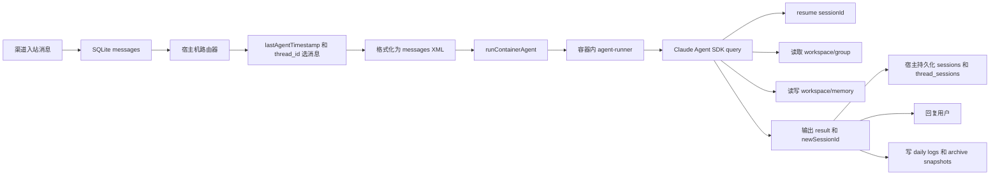
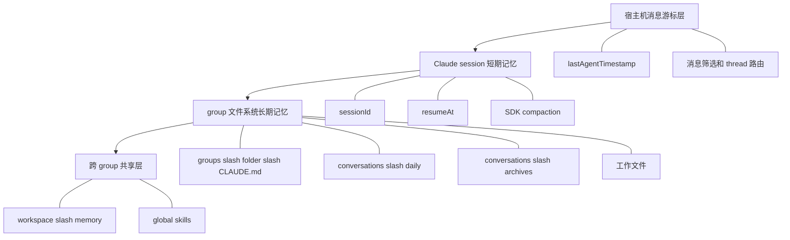
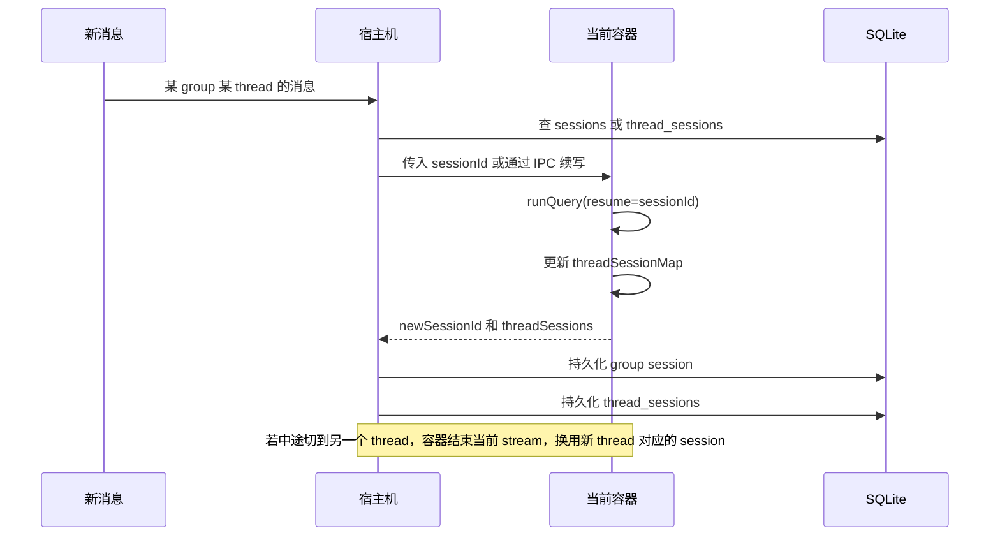
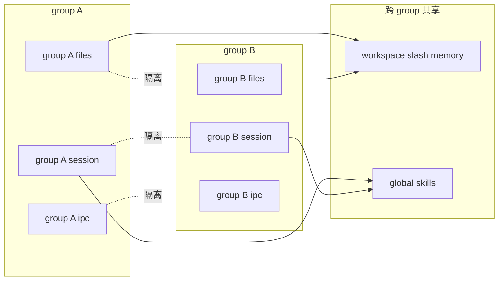

# NanoClaw 记忆系统调研

调研日期：2026-03-08

本文基于当前仓库代码的实际实现梳理，重点看了：

- `src/index.ts`
- `src/container-runner.ts`
- `container/agent-runner/src/index.ts`
- `src/db.ts`
- `src/group-queue.ts`
- `src/ipc.ts`
- `src/mount-security.ts`
- `groups/*/CLAUDE.md`
- `data/sessions/*/.claude/*`
- `data/global-memory/*`

先给结论：这个项目的“记忆”不是单一机制，而是 4 层叠加。

1. 宿主机数据库游标层：决定“这次要把哪些消息喂给 agent”。
2. Claude session 层：通过 `sessionId` 和 `resumeAt` 维持短期连续上下文。
3. group 文件系统层：每个 group 自己的 `CLAUDE.md`、`conversations/daily/`、`conversations/archives/`、工作文件。
4. 跨 group 共享层：`/workspace/memory` 与全局 skills。

真正重要的一点是：短期记忆主要靠 Claude Agent SDK 的 session；长期记忆主要靠文件；跨 group 共享主要靠共享目录和 prompt 约束，而不是完全靠物理隔离。

## 1. 总体分层图

### 1.1 消息进入系统后的链路

1. 渠道层把入站消息写入 SQLite `messages` 表。
2. 宿主进程根据 `lastAgentTimestamp`、`thread_id`、group 配置，决定这次要取哪些消息。
3. 宿主把消息格式化成 `<messages>...</messages>` 传给容器里的 `agent-runner`。
4. 容器里通过 `query()` 调 Claude Agent SDK，并用 `resume: sessionId` 接上之前的会话。
5. 宿主把新的 `sessionId`、`threadSessions` 持久化回数据库。
6. 日常流水日志落在 `conversations/daily/`，PreCompact 归档落在 `conversations/archives/`，全局记忆落在 `/workspace/memory`。



### 1.2 记忆层级

- 短期会话记忆：Claude session，自带上下文窗口与 compaction。
- group 内长期记忆：`groups/{group}/CLAUDE.md`、`conversations/daily/`、`conversations/archives/`、其他 md/工作文件。
- 跨 group 共享记忆：`data/global-memory` 挂载成 `/workspace/memory`。
- 跨 group 共享能力：`data/global-skills` 分发到每个 group 的 `.claude/skills/`。



## 2. 短期记忆：每次调用 agent-runner 时 context 怎么保持一致

### 2.1 宿主机并不是“每条消息都开一个全新会话”

`src/index.ts` 里消息处理有两种路径：

- 没有活跃容器：走 `runAgent()`，新启一个容器。
- 已有活跃容器：走 `queue.sendMessage()`，把新消息写进 `data/ipc/{group}/input/*.json`，直接喂给当前容器。

这意味着“一个 group 的一次活跃交互期”通常对应“一个还活着的容器 + 一个持续中的 Claude session”。

### 2.2 真正保持上下文一致的是 `sessionId`

宿主侧会先解析本次该用哪个 session：

- 非 thread 场景：用 `sessions[group.folder]`
- thread 场景：用 `thread_sessions(chat_jid, thread_id)`

然后把这个 `sessionId` 传进容器。

容器侧在 `container/agent-runner/src/index.ts` 中调用 SDK：

- `resume: sessionId`
- `resumeSessionAt: lastAssistantUuid`

其中：

- `resume` 决定接哪条历史会话
- `resumeSessionAt` 决定从哪一个 assistant 消息位置继续

这就是短期记忆连续性的核心。

### 2.3 容器内不是一次 query 就退出，而是一个 query loop

`agent-runner` 里有一个 query loop：

1. 先跑一次 `runQuery(prompt, sessionId, ...)`
2. 结束后不立刻退出，而是 `waitForIpcMessage()`
3. 收到新消息继续下一轮 query
4. 收到 `_close` sentinel 才退出

所以一个容器在空闲超时前，可以持续接多轮消息，减少“反复重建上下文”的成本。

### 2.4 为什么 thread 切换还能保持一致

容器内维护了一个内存态 `threadSessionMap`：

- 当前 thread 收到新的 `sessionId` 后，会写进 map
- 中途如果 IPC 来了另一个 thread 的消息，会结束当前 stream，切换到对应 thread 的 session
- 退出前会把所有 `threadSessions` 一次性回传给宿主

宿主再把它们持久化到 SQLite `thread_sessions` 表。

所以 thread 级短期记忆是两级缓存：

- 容器内临时 map
- 宿主持久化表



### 2.5 “短期记忆”还有两个补充机制

- `lastAgentTimestamp`：它不是 LLM 记忆，而是宿主的消息游标，控制这次该取哪些消息进入 prompt。
- SDK 自带 compaction：上下文过长时会压缩，但压缩前通过 `PreCompact` hook 把完整 transcript 归档到 `conversations/archives/`。

### 2.6 定时任务的 context 也是显式选择的

定时任务不是默认继承上下文，而是有两种模式：

- `context_mode = group`：复用这个 group 当前 session
- `context_mode = isolated`：不给 `sessionId`，从新会话启动

所以任务系统本身也把“短期记忆是否继承”做成了显式开关。

## 3. 每个 group 的 context 怎么处理

### 3.1 group 是一等隔离单元

每个注册 group 至少有三套独立空间：

- `groups/{folder}/`：这个 group 的工作目录与对话日志
- `data/sessions/{folder}/.claude/`：这个 group 的 Claude 用户态目录
- `data/ipc/{folder}/`：这个 group 的 IPC 命名空间

因此 group 之间默认不会共享：

- Claude session
- IPC 消息
- `conversations/daily/`
- `conversations/archives/`
- group 工作文件

### 3.2 prompt 的 group 视角

对 agent 来说，工作目录固定是 `/workspace/group`。

这个目录通常包含：

- `CLAUDE.md`
- `conversations/daily/`
- `conversations/archives/`
- agent 运行过程中写下的其他 md / 工作文件

所以 group 的长期上下文，本质上是“这个工作目录里可读的文件集合”。

### 3.3 同一 group 内还有 thread 粒度

Feishu 的话题群是 thread-aware：

- group 普通消息：共用 group 级 session
- thread_group：每个 `thread_id` 一条独立 session

因此一个 group 内部又分成两种上下文模型：

1. 普通 group 级上下文
2. thread 子上下文

### 3.4 `conversations/` 的作用

当前实现里，`conversations/` 被拆成两类：

- 宿主机在每次用户/机器人发言时，持续追加到 `conversations/daily/YYYY-MM-DD.md`
- 容器在 compaction 前，把完整 transcript 归档到 `conversations/archives/YYYY-MM-DD-*.md`

所以现在两者分工更清晰：

- `daily/`：流水时间线，适合按时间回放
- `archives/`：compact 前的阶段性会话快照，适合恢复较老上下文

## 4. group 和 group 之间的记忆怎么处理

### 4.1 默认不自动互通

group 之间没有“自动共享会话”机制。

不会共享的东西：

- `sessionId`
- `thread_sessions`
- `groups/{folder}/conversations/daily/`
- `groups/{folder}/conversations/archives/`
- `groups/{folder}` 下的私有文件
- `data/ipc/{folder}`

所以从实现上讲，group A 的聊天短期上下文不会自然流入 group B。

### 4.2 真正的跨 group 共享只有两类

第一类：全局记忆目录

- 宿主机目录：`data/global-memory/`
- 容器内路径：`/workspace/memory`

这里设计上放：

- `SOUL.md`
- `USER.md`
- `knowledge/`
- `episodes/`

第二类：全局 skills

- 宿主机目录：`data/global-skills/`
- 每次容器启动时复制到该 group 的 `data/sessions/{group}/.claude/skills/`

这意味着：

- skills 是全局共享能力
- `/workspace/memory` 是全局共享知识



### 4.3 跨 group 隐私主要靠 prompt 约束，不是硬隔离

这是当前实现里最值得注意的一点。

虽然 `data/sessions/{group}/.claude/`、`groups/{group}/` 都是隔离的，但 `/workspace/memory` 是所有容器共享、且当前代码里是可写的。

也就是说：

- group 间私有 session 是隔离的
- 但跨 group 共享知识库是共享可写的
- 隐私规则主要由 `data/sessions/feishu_main/.claude/CLAUDE.md` 中的文字约束来保证

换句话说，跨 group 隐私目前更多是“制度约束”，不是“文件系统强隔离”。

### 4.4 `groups/global/CLAUDE.md` 的位置

非 main group 在容器启动时，会额外挂载：

- 宿主机：`groups/global/`
- 容器内：`/workspace/global`

然后 `agent-runner` 会读取 `/workspace/global/CLAUDE.md`，以 `systemPrompt.append` 的方式拼到系统提示里。

这相当于一个“面向所有非 main group 的全局 prompt 层”。

注意它和 `/workspace/memory` 不是一回事：

- `groups/global/CLAUDE.md`：显式 prompt 注入
- `/workspace/memory/*`：共享文件记忆，由 prompt 引导 agent 主动去读写

## 5. `memory.md`、`claude.md`、skills、`SOUL.md`、`USER.md` 的作用域与生效方式

这一部分最容易混淆，因为仓库里实际上有不止一套“记忆/提示词/技能”。

### 5.1 先说结论

从当前实现看，运行中的 agent 主要会接触 5 套上下文载体：

1. `groups/{group}/CLAUDE.md`
2. `data/sessions/{group}/.claude/CLAUDE.md`
3. `groups/global/CLAUDE.md`
4. `data/global-memory/SOUL.md` 与 `USER.md`
5. `data/sessions/{group}/.claude/skills/`

而仓库根目录的 `CLAUDE.md`、`.claude/skills/` 更多是“开发仓库自身”的上下文，不是当前运行容器自动加载的主要来源。

### 5.2 仓库根 `CLAUDE.md`

作用域：主要是仓库开发上下文，不是运行时 group prompt 主链路

原因：

- 运行中容器的工作目录是 `/workspace/group`
- main group 虽然额外挂了 `/workspace/project`，但 `cwd` 仍然不是项目根
- `agent-runner` 也没有把 `/workspace/project` 放进 `additionalDirectories`

因此从当前代码实现看，仓库根 `CLAUDE.md` 通常不会像 `groups/{group}/CLAUDE.md` 那样被运行中的 agent 自动作为 project memory 加载。

它更像：

- 开发这个仓库时给人类/Codex 的工程说明
- 或者未来可被技能系统、定制流程复用的 repo 级文档

### 5.3 `groups/{group}/CLAUDE.md`

作用域：单个 group

生效方式：

- 容器工作目录是 `/workspace/group`
- SDK 配置了 `settingSources: ['project', 'user']`
- 因此这里的 `CLAUDE.md` 会作为 project 级提示被 Claude Code 自动加载

用途：

- 定义这个 group 的工作区说明
- 告诉 agent 这个 group 的文件该怎么用
- 可以放 group 特定规则或背景

当前这个实例里，真正运行中的主控制组不是 `groups/main/`，而是数据库里标记 `is_main=1` 的 `groups/feishu_main/`。

### 5.4 `data/sessions/{group}/.claude/CLAUDE.md`

作用域：单个 group 的 Claude 用户态目录

生效方式：

- 宿主把 `data/sessions/{group}/.claude/` 挂到容器的 `/home/node/.claude`
- SDK 同样启用了 `settingSources: ['project', 'user']`
- 所以这个文件会作为 user 级 CLAUDE 自动加载

用途：

- 定义 agent 的“操作手册”
- 指导它去读取 `/workspace/memory/SOUL.md` 和 `USER.md`
- 约束跨 group 隐私
- 约束 session end 时如何把知识回写到共享记忆

这层比 `groups/{group}/CLAUDE.md` 更像“运行时人格/制度层”。

### 5.5 `groups/global/CLAUDE.md`

作用域：所有非 main group

生效方式：

- 只有非 main group 会挂载 `groups/global` 到 `/workspace/global`
- `agent-runner` 显式读 `/workspace/global/CLAUDE.md`
- 用 `systemPrompt.append` 追加到系统提示

用途：

- 提供全局共享的 prompt 规则
- 给所有非 main group 一个统一的默认行为层

它不是 SDK 自动发现的，而是代码显式追加的。

### 5.6 `SOUL.md` 与 `USER.md`

作用域：全局，跨所有 group

物理位置：

- 宿主机：`data/global-memory/SOUL.md`
- 宿主机：`data/global-memory/USER.md`
- 容器内统一映射为：`/workspace/memory/SOUL.md` 与 `/workspace/memory/USER.md`

生效方式：

- 不是宿主代码自动拼进 prompt
- 而是 `data/sessions/{group}/.claude/CLAUDE.md` 明确要求 agent 在 session 开始时先读它们

因此它们属于“被操作手册强制读取的共享记忆”，不是 SDK 的原生 `CLAUDE.md` 层。

### 5.7 `memory.md` 到底是什么

当前仓库里没有一个统一、核心、显式参与运行时装配的 `memory.md` 文件。

更接近“memory”概念的有两类：

1. 项目自定义共享记忆：`/workspace/memory/*`
2. Claude Code 自己可能维护的 auto-memory：`data/sessions/{group}/.claude/memory/*`

第二类当前代码没有直接读写，但 `settings.json` 里开启了：

- `CLAUDE_CODE_DISABLE_AUTO_MEMORY = 0`

所以可以合理推断：

- `.claude/memory/` 更像 Claude Code 运行时自己的 memory 存储
- 但这个项目自己的核心长期记忆设计，主要还是围绕 `/workspace/memory` 和 group 文件夹展开

这部分我会明确标注为“从目录和配置推断”，不是宿主代码显式消费。

### 5.8 skills 的作用域要分成两套系统

这是另一个非常容易误解的点。

第一套：运行时 Claude skills

- 源头：`container/skills/` 与 `data/global-skills/`
- 分发目标：`data/sessions/{group}/.claude/skills/`
- 生效位置：容器里的 `/home/node/.claude/skills/`

这套 skills 会被实际运行中的 Claude Code 自动识别，作用域是“全局共享给所有 group”。

第二套：仓库开发用的 `.claude/skills/`

- 位于仓库根目录
- 主要用于这个 NanoClaw 仓库本身的 skill-engine、定制化和开发工作流

当前 `src/container-runner.ts` 并不会直接把仓库根 `.claude/skills/` 挂进运行中的 agent 容器。

所以这两套 skills 不应混为一谈：

- 根目录 `.claude/skills/`：更像 repo 自身的工程能力
- `data/global-skills -> per-group .claude/skills`：才是运行时 agent 真正在用的技能分发链路

## 6. 容器挂载：各个 group 是怎么处理的

### 6.1 所有 group 的公共挂载

所有 group 都会拿到这些挂载：

- `data/sessions/{group}/.claude` -> `/home/node/.claude`
- `data/global-memory` -> `/workspace/memory`
- `data/ipc/{group}` -> `/workspace/ipc`
- `data/sessions/{group}/agent-runner-src` -> `/app/src`

含义分别是：

- `/home/node/.claude`：这个 group 的 Claude 用户态与 skills
- `/workspace/memory`：跨 group 共享记忆
- `/workspace/ipc`：这个 group 专属 IPC
- `/app/src`：这个 group 专属、可改写的 agent-runner 源码

```mermaid
flowchart TD
    subgraph Host[宿主机]
        H1[data slash sessions slash group slash .claude]
        H2[data slash global-memory]
        H3[data slash ipc slash group]
        H4[data slash sessions slash group slash agent-runner-src]
        H5[groups slash group]
        H6[groups slash global]
        H7[project root only for main]
    end

    subgraph Container[容器]
        C1[/home/node/.claude]
        C2[/workspace/memory]
        C3[/workspace/ipc]
        C4[/app/src]
        C5[/workspace/group]
        C6[/workspace/global only non-main]
        C7[/workspace/project only main]
    end

    H1 --> C1
    H2 --> C2
    H3 --> C3
    H4 --> C4
    H5 --> C5
    H6 --> C6
    H7 --> C7
```

### 6.2 main group 和非 main group 的差异

main group：

- 挂载整个项目根目录到 `/workspace/project`
- 挂载自己的 group 目录到 `/workspace/group`

非 main group：

- 只挂载自己的 group 目录到 `/workspace/group`
- 额外挂载 `groups/global` 到 `/workspace/global`（只读）

### 6.3 额外挂载 additionalMounts

group 可以在 `containerConfig.additionalMounts` 里声明额外挂载。

规则：

- 必须经过 `~/.config/nanoclaw/mount-allowlist.json` 校验
- 只会挂到 `/workspace/extra/{containerPath}`
- 非 main group 可以被 `nonMainReadOnly` 强制降级为只读
- `.ssh`、`.aws`、`.env`、密钥类路径会被拦截

这是 group 接入外部资料库、代码仓库、本地目录的扩展机制。

### 6.4 当前实现里一个很关键的事实

代码实际行为是：

- main group 的项目根目录挂载是读写
- `/workspace/memory` 对所有 group 都是读写

这和 `docs/SECURITY.md` 里写的“main 项目根只读”“global memory 更偏只读/受限”并不完全一致。

所以如果你要理解“今天这个系统实际上怎么跑”，应该以 `src/container-runner.ts` 为准，而不是以文档描述为准。

## 7. 当前实例里的实际作用域

结合本机数据库，这个实例当前注册了 3 个 group：

- `feishu_main`：`is_main = 1`
- `feishu_oc_802bd743742b597c2ea44f6558b42381`
- `feishu_oc_e0f7074ee90981b28a1fc893c899609a`

这意味着当前运行时的主控制组是：

- `groups/feishu_main/`
- `data/sessions/feishu_main/.claude/`

而不是仓库里的 `groups/main/`。

所以对这份实际部署来说：

- `groups/main/CLAUDE.md` 更像模板/示例
- `groups/feishu_main/CLAUDE.md` 才是 live group project memory
- `data/sessions/feishu_main/.claude/CLAUDE.md` 才是 live user-level runtime manual

## 8. 我对这个记忆系统的结构化判断

### 8.1 它的优点

- 分层很清楚：session 连续性、group 隔离、全局共享各有位置。
- thread-aware 设计做得比较完整，Feishu 话题群能独立保持上下文。
- 通过文件系统挂载让记忆“可见、可审计、可 grep”，不完全黑盒。
- global skills 与 global memory 分离，能力共享和知识共享不是一回事。

### 8.2 它的真实边界

- group 私有短期记忆：隔离得比较实。
- group 私有长期文件：隔离得也比较实。
- 跨 group 共享知识：目前主要靠 prompt 纪律，不是硬权限。
- main group 权限：当前代码里比文档写得更大。

### 8.3 如果用一句话概括

这个系统本质上是：

“用 Claude session 维护短期记忆，用 group 工作目录沉淀长期记忆，用共享 memory/skills 做跨 group 共识层，再用宿主机游标与 IPC 把这些层串起来。”

## 9. 还可以继续深挖的两个方向

如果后面你想继续把这套设计打磨得更稳，我建议优先看这两个方向：

1. 把跨 group 全局记忆从“prompt 约束”升级成“物理权限 + 标准写入协议”。
2. 统一文档与实现，尤其是 main group 项目根挂载权限、global memory 的真实可写范围。
