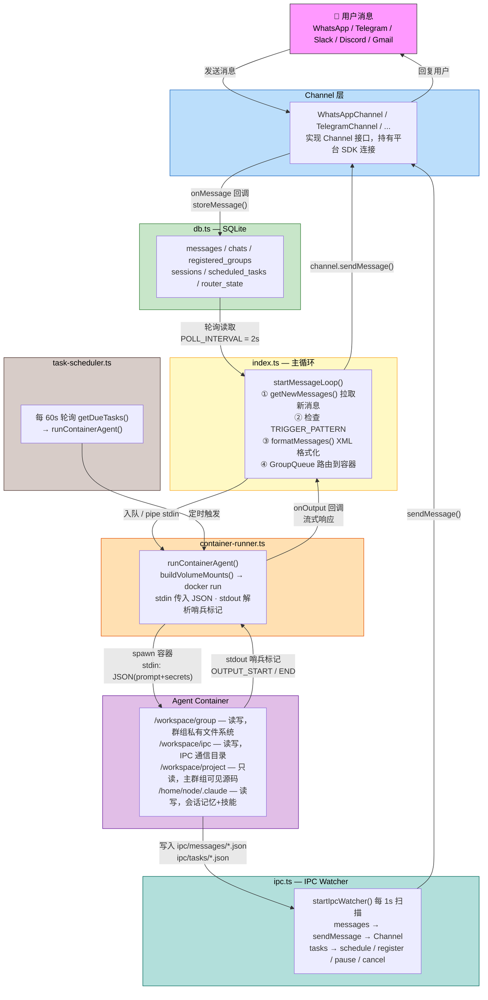

# NanoClaw 架构分析

---

## 1. 项目定位与设计哲学

NanoClaw 是一个**个人 Claude AI 助手网关**，让你通过 WhatsApp/Telegram/Slack 等消息平台与 Claude Agent 交互。核心设计原则有三：**隔离优先**（每个群组的 Agent 运行在独立容器内，拥有独立文件系统和会话记忆）；**单进程编排**（一个 Node.js 进程统管所有渠道接入、消息路由、容器调度，无需微服务）；**技能即补丁**（通过 `git merge-file` 三方合并机制添加新能力，技能是可组合、可回滚的代码补丁，不是插件框架）。

---

## 2. 整体架构图



---

## 3. 核心模块逐一说明

### `src/types.ts` — 类型契约层
**职责**：定义全系统共享的数据结构，是理解整个系统的基础。

关键类型：
- `Channel` 接口：所有渠道实现的合约——`connect()`, `sendMessage()`, `ownsJid()`, `isConnected()`, `disconnect()`, 可选的 `setTyping()` 和 `syncGroups()`
- `RegisteredGroup`：已激活的群组配置（`folder`, `trigger`, `isMain`, `requiresTrigger`, `containerConfig`）
- `NewMessage`：消息体（`chat_jid`, `sender`, `content`, `timestamp`, `is_from_me`）
- `ScheduledTask`：定时任务（支持 `cron`, `interval`, `once` 三种调度类型）

无外部依赖，被所有模块 import。

---

### `src/config.ts` — 配置中心
**职责**：读取 `.env` 并导出全局常量，是调参的唯一入口。

关键配置：
- `TRIGGER_PATTERN`：`/^@Andy\b/i`，触发词正则
- `POLL_INTERVAL = 2000`：消息轮询间隔
- `IPC_POLL_INTERVAL = 1000`：IPC 文件扫描间隔
- `IDLE_TIMEOUT = 1800000`：容器 stdin 空闲关闭时间（30分钟）
- `CONTAINER_TIMEOUT = 1800000`：容器最大运行时间
- `DATA_DIR / GROUPS_DIR / STORE_DIR`：关键目录路径
- `MOUNT_ALLOWLIST_PATH`：挂载安全白名单路径（在 `~/.config/nanoclaw/`，不在项目内）

---

### `src/db.ts` — 持久化层
**职责**：封装 SQLite 操作（`better-sqlite3`），对外暴露语义化函数。

核心表与对应函数：

| 表 | 主要函数 |
|---|---|
| `messages` | `storeMessage()`, `getNewMessages()`, `getMessagesSince()` |
| `chats` | `storeChatMetadata()`, `getAllChats()` |
| `registered_groups` | `setRegisteredGroup()`, `getAllRegisteredGroups()` |
| `sessions` | `setSession()`, `getAllSessions()` |
| `scheduled_tasks` | `createTask()`, `getDueTasks()`, `updateTaskAfterRun()` |
| `router_state` | `setRouterState()`, `getRouterState()` — 存 `last_timestamp` 等游标 |

`getNewMessages()` 里有两个游标的区别很关键：
- `lastTimestamp`：已"看见"的消息游标（所有群组共用），防止重复拉取
- `lastAgentTimestamp[chatJid]`：每个群组已"处理"的游标，Agent 崩溃时可回滚

---

### `src/channels/registry.ts` — 渠道注册表
**职责**：维护一个 `Map<string, ChannelFactory>`，实现渠道的自注册机制。

暴露三个函数：
```
registerChannel(name, factory)   // 渠道模块启动时调用
getChannelFactory(name)           // index.ts 读取用于实例化
getRegisteredChannelNames()       // index.ts 遍历所有已注册渠道
```

每个渠道文件（如 `telegram.ts`）在模块加载时调用 `registerChannel('telegram', factory)`，工厂函数在凭证缺失时返回 `null`，从而实现"安装了但没配置就跳过"的逻辑。

---

### `src/router.ts` — 消息格式化层
**职责**：消息的格式化与路由辅助。非常精简，只有46行。

关键函数：
- `formatMessages(messages)`：将消息数组序列化为 XML 格式传给 Agent：
  ```xml
  <messages>
    <message sender="Alice" time="2026-03-05T10:00:00Z">@Andy 帮我查一下天气</message>
  </messages>
  ```
- `formatOutbound(rawText)`：剥离 Agent 回复中的 `<internal>...</internal>` 推理块再发出
- `findChannel(channels, jid)`：通过 `ownsJid()` 找到负责某 JID 的渠道实例

---

### `src/container-runner.ts` — 容器编排核心
**职责**：构建挂载配置、启动容器、解析流式输出。

核心函数 `runContainerAgent()` 的执行流程：
1. `buildVolumeMounts()` 按群组权限构建挂载列表
2. `buildContainerArgs()` 生成 `docker run -i --rm ...` 参数
3. `spawn(CONTAINER_RUNTIME_BIN, containerArgs)` 启动容器
4. 通过 `container.stdin.write(JSON.stringify(input))` 传入 prompt + secrets
5. 流式解析 stdout 中的 `---NANOCLAW_OUTPUT_START---` / `---NANOCLAW_OUTPUT_END---` 哨兵对
6. 每解析到一个输出块就回调 `onOutput(parsed)`，实现流式响应

---

### `src/ipc.ts` — 进程间通信（文件系统 IPC）
**职责**：监听容器写入宿主机的 JSON 文件，执行对应操作。

`startIpcWatcher()` 每1秒扫描 `data/ipc/<group_folder>/` 目录：
- `messages/*.json`：Agent 要发送的消息 → 调 `sendMessage()` 出去
- `tasks/*.json`：任务操作请求，支持 `schedule_task`, `pause_task`, `resume_task`, `cancel_task`, `refresh_groups`, `register_group` 六种类型

安全机制：非主群组的 IPC 请求只能操作自己的数据，`isMain` 标志由目录路径决定（不可伪造）。

---

### `src/index.ts` — 系统编排器
**职责**：粘合所有模块，实现主状态机和消息循环。

`main()` 启动序列：
1. `ensureContainerSystemRunning()` → 确保 Docker/Apple Container 运行
2. `initDatabase()` → SQLite 初始化+迁移
3. `loadState()` → 从 DB 恢复游标、sessions、registeredGroups
4. 实例化并 `connect()` 所有渠道
5. `startSchedulerLoop()` → 定时任务调度
6. `startIpcWatcher()` → IPC 文件监听
7. `recoverPendingMessages()` → 启动恢复（处理崩溃遗留消息）
8. `startMessageLoop()` → 主轮询循环

---

## 4. 消息全链路流程

以"用户在 Telegram 群发送 `@Andy 帮我查天气`"为例：

```
① 用户发消息
   TelegramChannel.bot.on('message:text') 触发
   构造 NewMessage { chat_jid: 'tg:123456', content: '@Andy 帮我查天气', ... }

② 存储阶段
   → index.ts 的 channelOpts.onMessage() 被调用
   → 校验 sender-allowlist（如有）
   → storeMessage(msg) 写入 SQLite messages 表

③ 轮询检测（每2秒）
   startMessageLoop() → getNewMessages(registeredJids, lastTimestamp)
   发现新消息，检查 TRIGGER_PATTERN.test('@Andy 帮我查天气') → true
   getMessagesSince(chatJid, lastAgentTimestamp[chatJid]) 拉取所有未处理消息（含上下文）

④ 排队
   queue.sendMessage(chatJid, formatted) → 检查是否有活跃容器
   → 若有：直接 pipe 到容器 stdin（实时追加）
   → 若无：queue.enqueueMessageCheck(chatJid) → 触发 processGroupMessages()

⑤ 容器启动
   processGroupMessages() → formatMessages() 生成 XML prompt
   → runAgent() → writeTasksSnapshot() / writeGroupsSnapshot() 更新快照
   → runContainerAgent() 启动容器
   写入 stdin: {"prompt":"<messages>...", "sessionId":"xxx", "isMain":false, ...}
   同时包含 secrets(ANTHROPIC_API_KEY)

⑥ Agent 执行
   容器内 agent-runner 接收 stdin JSON
   调用 Claude Code SDK（resume session / new session）
   Agent 可读 /workspace/group（私有文件系统）、/workspace/ipc（IPC目录）
   Agent 处理完毕，向 stdout 写入:
   ---NANOCLAW_OUTPUT_START---
   {"status":"success","result":"今天北京天气晴，气温5-12℃","newSessionId":"ses_xxx"}
   ---NANOCLAW_OUTPUT_END---

⑦ 流式回调（onOutput）
   container-runner 的 stdout 监听器检测到哨兵对
   解析 JSON，调用 onOutput(parsed)
   → processGroupMessages 的回调被触发
   → stripInternalTags() 清理 <internal> 块
   → channel.sendMessage(chatJid, text) 发出回复
   → TelegramChannel.bot.api.sendMessage() 发回 Telegram

⑧ 状态更新
   sessions[group.folder] = newSessionId（保存会话连续性）
   lastAgentTimestamp[chatJid] 更新为最后一条消息的时间戳
   saveState() 持久化到 SQLite router_state 表
```

---

## 5. 容器隔离机制

### 挂载结构

`buildVolumeMounts()` 根据 `isMain` 决定挂载权限：

| 挂载路径（容器内） | 宿主机路径 | 主群组 | 普通群组 |
|---|---|---|---|
| `/workspace/group` | `groups/<folder>/` | 读写 | 读写 |
| `/workspace/project` | 项目根目录 | 只读 | ❌ 不挂载 |
| `/workspace/global` | `groups/global/` | N/A | 只读 |
| `/workspace/ipc` | `data/ipc/<folder>/` | 读写 | 读写（隔离命名空间） |
| `/home/node/.claude` | `data/sessions/<folder>/.claude/` | 读写 | 读写（各群组独立） |
| `/app/src` | `data/sessions/<folder>/agent-runner-src/` | 读写 | 读写（可定制agent-runner） |

`.env` 被主动遮盖：`/workspace/project/.env` → `/dev/null`，secrets 只通过 stdin JSON 传入，绝不写磁盘。

### IPC 通信机制

容器与宿主机通信是**纯文件系统异步轮询**：

```
容器写入: /workspace/ipc/messages/<uuid>.json
              ↕ bind mount
宿主机路径: data/ipc/<folder>/messages/<uuid>.json

ipc.ts 每1秒扫描 → 读取 → 执行 → 删除文件
```

安全权限模型：
- `isMain` 由宿主机目录路径决定（容器只能写自己的 ipc 目录）
- 主群组可以向任意 JID 发消息、注册新群组
- 非主群组只能向自己发消息、只能管理自己的定时任务

### 会话连续性

每个群组拥有独立的 `sessionId`（存于 `sessions` 表），传给 `runContainerAgent()` 后通过 Claude Code SDK `--resume` 恢复，实现跨容器生命周期的记忆持久化。

---

## 6. 扩展机制

### 添加新 Channel（以添加 Telegram 为例）

**改动点只有两处：**

**第一步**：创建 `src/channels/telegram.ts`，实现 `Channel` 接口，并在文件末尾自注册：

```typescript
// telegram.ts 末尾
registerChannel('telegram', (opts: ChannelOpts): Channel | null => {
  const env = readEnvFile(['TELEGRAM_BOT_TOKEN']);
  const token = process.env.TELEGRAM_BOT_TOKEN || env.TELEGRAM_BOT_TOKEN;
  if (!token) return null;  // 未配置则跳过
  return new TelegramChannel(token, opts);
});
```

JID 约定格式由 `ownsJid()` 决定，Telegram 使用 `tg:` 前缀：
```typescript
ownsJid(jid: string): boolean {
  return jid.startsWith('tg:');
}
```

**第二步**：在 `src/channels/index.ts` 中添加一行 import（触发自注册）：

```typescript
import './telegram.js';
```

`index.ts` 的 `main()` 函数会自动遍历 `getRegisteredChannelNames()` 实例化所有已注册渠道，无需修改。

### 添加新 Skill（NanoClaw 技能系统）

Skill 是通过 `git merge-file` 合并到代码库的补丁包，不是运行时插件。

**目录结构**：

```
.claude/skills/add-yourskill/
  SKILL.md          # 技能描述（Claude Code 读取）
  manifest.yaml     # 声明 adds/modifies/npm_dependencies/env_additions
  add/              # 新增文件（直接 cp）
    src/channels/yourskill.ts
  modify/           # 修改文件（三方合并）
    src/channels/index.ts   # 添加 import 语句
```

**`manifest.yaml` 结构**：
```yaml
skill: yourskill
version: 1.0.0
adds:
  - src/channels/yourskill.ts
modifies:
  - src/channels/index.ts
structured:
  npm_dependencies:
    your-sdk: "^1.0.0"
  env_additions:
    - YOUR_API_KEY
```

通过 `/add-yourskill` 斜杠命令触发安装时，Claude Code 读取 `SKILL.md` 并按照 `docs/nanoclaw-architecture-final.md` 描述的三方合并流程自动合并代码。

---

## 7. 推荐阅读路径

按理解依赖顺序排列：

| 顺序 | 文件 | 理由 |
|------|------|------|
| 1 | `src/types.ts` | 先建立数据结构认知，所有函数签名都依赖这里 |
| 2 | `src/config.ts` | 了解全局常量，读其他文件时不会对魔法数字感到困惑 |
| 3 | `src/db.ts` | 理解数据如何存取，特别是两个游标（`lastTimestamp` vs `lastAgentTimestamp`）的区别 |
| 4 | `src/channels/registry.ts` | 极简的自注册机制，先理解再看 Channel 实现 |
| 5 | `src/router.ts` | 只有46行，但 `formatMessages()` 的 XML 格式是 Agent 的输入格式 |
| 6 | `src/index.ts` | 系统总览，`main()` → `startMessageLoop()` → `processGroupMessages()` 是核心主线 |
| 7 | `src/container-runner.ts` | 重点看 `buildVolumeMounts()` 和 `runContainerAgent()` 的 stdout 流式解析 |
| 8 | `src/ipc.ts` | 理解容器与宿主机的双向通信，重点看 `processTaskIpc()` 的权限模型 |
| 9 | `src/task-scheduler.ts` | 定时任务调度，相对独立，最后读 |
| 10 | `.claude/skills/add-telegram/add/src/channels/telegram.ts` | 完整的 Channel 实现范例，理解如何扩展 |
| 11 | `docs/nanoclaw-architecture-final.md` | Skills 三方合并架构，理解"如何安全地给项目添加新能力" |

**关键洞察**：整个系统的设计核心是**两个轮询 + 一个队列**——`startMessageLoop()`（2s）负责发现新消息并入队，`startIpcWatcher()`（1s）负责处理容器的反向请求，`GroupQueue` 负责确保每个群组的容器不并发，三者独立运转但共享 SQLite 状态，任何一个崩溃都可以从 DB 中恢复。
